# mohallaMitr — The Complete System Blueprint

[Mobile](./MOBILE.md) · [Web](./WEB.md) · [Backend](./BACKEND.md)

---

```
                        ┌─────────────────────────────┐
                        │    YOUR SOCIETY, YOUR SHOPS  │
                        │     60 SECONDS TO SAY YES    │
                        └─────────────────────────────┘
                                      │
            ┌─────────────┬───────────┼───────────┬──────────────┐
            ▼             ▼           ▼           ▼              ▼
       ┌─────────┐  ┌──────────┐ ┌────────┐ ┌─────────┐  ┌───────────┐
       │ RESIDENT│  │  OWNER   │ │ RIDER  │ │  ADMIN  │  │  EXPRESS   │
       │  (app)  │  │  (app)   │ │ (app)  │ │  (web)  │  │  (api)    │
       └────┬────┘  └────┬─────┘ └───┬────┘ └────┬────┘  └─────┬─────┘
            │             │           │           │              │
            └─────────────┴───────────┴───────────┴──────────────┘
                              ONE MONOREPO
```

> **Four humans. Three mobile flavors. One web dashboard. One API. One shared brain.**
> This file is the map. If you only read one doc, read this one.

---

## How to Read This

```
  START HERE ──► Big Picture ──► Order Flow ──► Deep Dives ──► Danger Board
       │                                                            │
       └──── or just CTRL+F what you need ──────────────────────────┘
```

| Symbol | Meaning |
|:------:|---------|
| `>>>` | Expand for deep dive |
| `!!!` | Danger / watch out |
| `~~~` | Folklore (outdated) |

---

## 1. The Big Picture

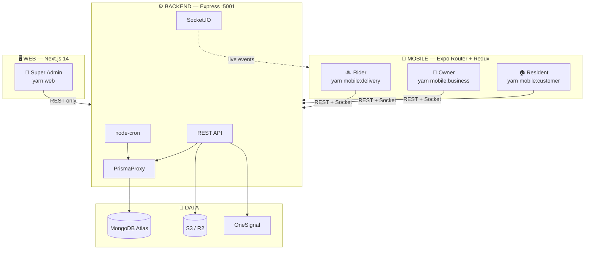

### The Stack at a Glance

| Layer | Mobile | Web | Backend |
|-------|--------|-----|---------|
| **Framework** | Expo SDK 55 + Router | Next.js 14 App Router | Express |
| **State** | Redux Toolkit | `useState` (no global) | — |
| **Styling** | React Native StyleSheet | Tailwind CSS | — |
| **DB** | — | — | MongoDB / Mongoose |
| **Auth storage** | AsyncStorage | localStorage | JWT + Mongo refresh tokens |
| **Realtime** | Socket.IO | None (poll) | Socket.IO server |
| **Push** | OneSignal + Expo local | — | OneSignal sender |
| **Monitoring** | Sentry | — | — |
| **Validation** | `@mohallamitr/shared` Zod | — | Zod (shared + local) |

---

## 2. Monorepo Map

```
OurBlock/
│
├── apps/
│   ├── mobile/          Expo Router + Redux — 3 roles, 1 binary
│   │   ├── app/         File-based routing (auth, user, owner, rider groups)
│   │   └── src/         hooks/, components/, services/, store/, constants/
│   │
│   ├── web/             Next.js 14 — super admin control room
│   │   └── src/app/     dashboard/ pages + lib/api.ts
│   │
│   ├── backend/         Express — the source of truth
│   │   └── src/         routes/, models/, services/, lib/, middleware/, jobs/
│   │
│   └── firebase/        ⚠️ LEGACY — do NOT deploy or trust
│
├── packages/
│   └── shared/          The peace treaty between apps
│       └── src/         types, constants, validation (Zod), utils
│
├── patches/             5 Expo SDK 55 patches (via patch-package)
├── specs/               Feature specifications
├── openspec/            Change proposals
├── docs/                You are here
│
├── package.json         Yarn workspaces root
├── app.json             Expo config (bundleId: com.mohallamitr.app)
└── tsconfig.json        Path aliases: @/*, @components/*, @hooks/*, etc.
```

> **Root deps:** expo ~55.0.19 · react 19.2.0 · react-native 0.83.6 · typescript 5.5.4
> **Engines:** node >=18, yarn >=1.22
> **Postinstall:** `patch-package` applies 5 Expo SDK patches automatically

---

## 3. The Four Humans

```
  ┌──────────────────────────────────────────────────────────────┐
  │                                                              │
  │   🏠 RESIDENT              🏪 OWNER                         │
  │   "I want paneer"          "60 seconds... ACCEPT!"          │
  │   Mobile (user build)      Mobile (owner build)             │
  │                                                              │
  │   🚲 RIDER                 👑 SUPER ADMIN                   │
  │   "On my way"              "Shop verified. Next."           │
  │   Mobile (rider build)     Web dashboard ONLY               │
  │                                                              │
  └──────────────────────────────────────────────────────────────┘
```

| Role | Client | Key Powers |
|------|--------|------------|
| `user` | Mobile (customer) | Browse society shops, cart, order, chat, review, refund request |
| `businessOwner` | Mobile (owner) | Catalog CRUD, accept/reject orders (60s!), manage riders, coupons |
| `deliveryPartner` | Mobile (rider) | View queue, start delivery, complete with proof photo |
| `superAdmin` | **Web only** | Verify shops, approve products, suspend users, manage banners, unblock shops |

---

## 4. The Order — Heart of Everything

> **Every feature exists to move an order from `pending` to `delivered` without the shop ghosting the resident.**

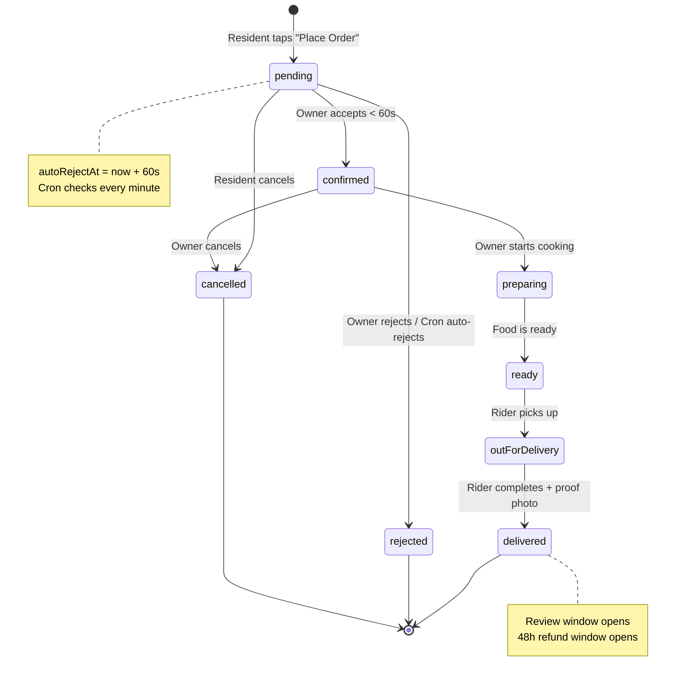

### The Complete Journey — Tap to Doorstep

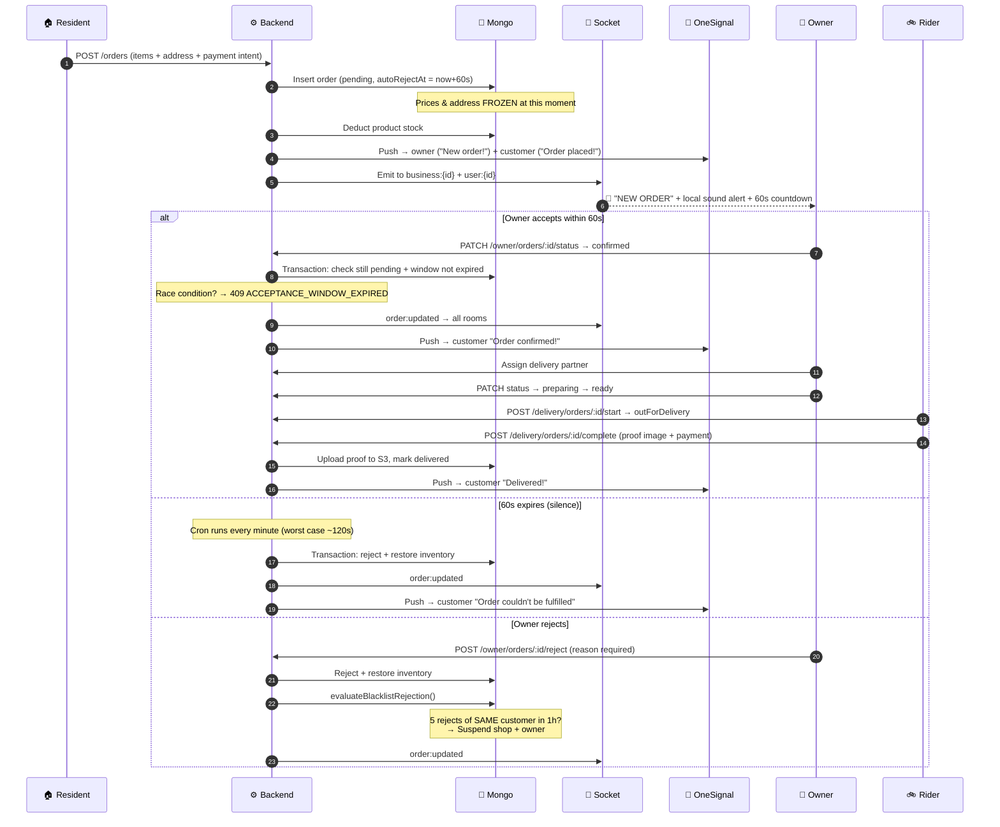

<details>
<summary><b>>>> Money Math on Every Order</b></summary>

```
  subTotal (sum of item prices × quantities)
+ platformFee         ₹2 flat
- couponDiscount      from validated coupon
─────────────────────
= finalAmount         what the customer pays

  paymentMethod: cash | upi | card | wallet   (label only — NO gateway)
  paymentTiming: atOrder | atDelivery
  paymentStatus: pending | completed | failed | cod
```

**There is no payment gateway.** `paymentStatus` is bookkeeping for "customer said they'll UPI the rider." Minimum order: **₹50**.

</details>

<details>
<summary><b>>>> The 60-Second Window — Edge Cases</b></summary>

| Scenario | What Happens |
|----------|-------------|
| Owner taps Accept at t=59s | `confirmed` — just in time |
| Owner taps Accept at t=61s | `409 ACCEPTANCE_WINDOW_EXPIRED` (if still pending) |
| Owner is offline for 2 minutes | Cron auto-rejects with "Store didn't respond within the 60-second window" |
| Two staff tap Accept simultaneously | Transaction ensures only one wins |
| Network lag makes socket late | REST is the truth; socket is cosmetic |
| Cron lag (worst case) | Job runs `* * * * *` — gap can be 60–120s before auto-reject fires |

</details>

<details>
<summary><b>>>> The Blacklist Escalation</b></summary>

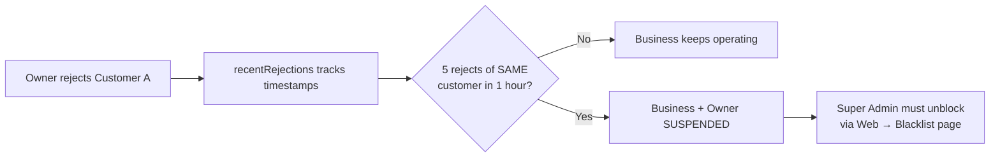

- The count is **per customer** — rejecting 5 different customers is fine
- `recentRejections` is a `Record<userId, timestamp[]>` on the Business doc
- `SuspensionHistory` collection logs every suspend/activate for audit
- Suspended owner sees a full-screen overlay + auto-logout countdown on mobile

</details>

---

## 5. Identity & Auth

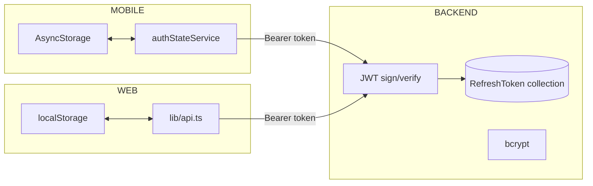

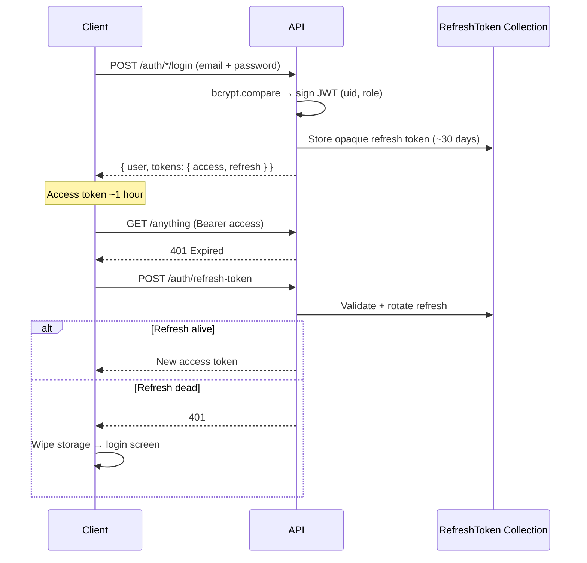

| Detail | Mobile | Web |
|--------|--------|-----|
| **Storage** | AsyncStorage (`authStateService`) | `localStorage` (`admin_*` keys) |
| **Refresh** | Axios interceptor auto-retries | `fetch` wrapper auto-retries |
| **Roles** | user, businessOwner, deliveryPartner | superAdmin only |
| **Network fail** | Does NOT logout (special-cased in root layout) | Does NOT logout |
| **Logout** | Clears AsyncStorage + disconnects socket | Clears localStorage + redirect |

<details>
<summary><b>!!! Mock Auth — The Silent Killer</b></summary>

`ENABLE_MOCK_AUTH` defaults to **on** unless explicitly set to `"false"`.

When on:
- Any `mock-token-*` string passes `requireAuth`
- Sockets don't authenticate
- Push notifications don't fire
- **"Realtime is broken on simulator" is usually this**

**Must be `false` in production. No exceptions.**

</details>

<details>
<summary><b>>>> Super Admin Access</b></summary>

- Login: `POST /auth/superadmin/login`
- Gate: `requireSuperAdmin` middleware — checks JWT role → DB role fallback → `SUPER_ADMIN_EMAILS` env allowlist
- **Default fallback email:** `ankushrishi5@gmail.com` — ship with a real allowlist
- Web has **no server-side route protection** — HTML loads for anyone, but API calls die without JWT
- XSS on the admin origin = stolen god-mode JWT

</details>

---

## 6. Realtime Architecture

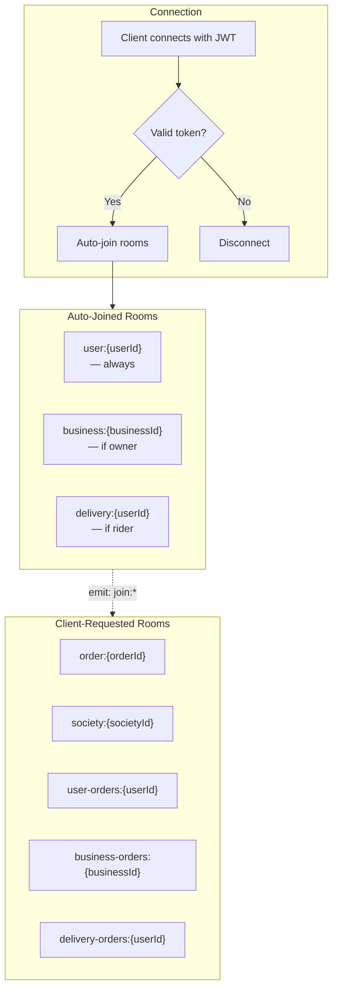

| Event | Payload | Sent To |
|-------|---------|---------|
| `order:updated` | Full order doc | `order:{id}` |
| `orders:user:updated` | Full order doc | `user-orders:{userId}` |
| `orders:business:updated` | Full order doc | `business-orders:{businessId}` |
| `orders:delivery:updated` | Full order doc | `delivery-orders:{partnerId}` |
| `business:updated` | Full business doc | `business:{id}` |
| `businesses:society:updated` | Full business doc | `society:{societyId}` |
| `business:products:changed` | `{ businessId }` | `business:{id}` |

> **Web admin has NO sockets.** It's pull-to-refresh only.
> Mobile reconnects on `AppState === 'active'` because iOS/Android kill idle WebSockets.

---

## 7. Data Model

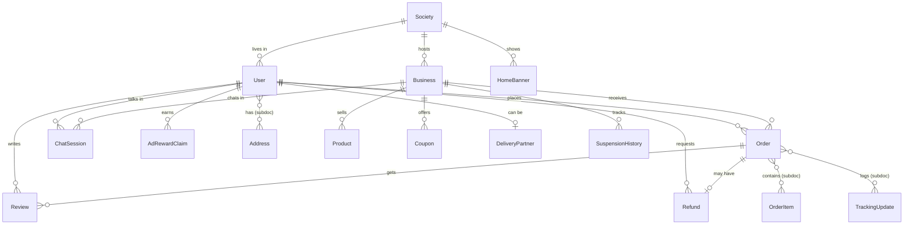

<details>
<summary><b>>>> All 16 Collections — Field Summary</b></summary>

| Collection | Key Fields | Notes |
|-----------|------------|-------|
| **Society** | name, address, city, state, pincode, status, totalBusinesses, totalUsers | The planet. Everything scoped to this |
| **User** | firstName, lastName, email, phone, role, societyId, status, addresses[], pushToken, favoriteBusinesses[] | Single collection, all 4 roles |
| **RefreshToken** | token, userId, expiresAt, revoked | Logout = revoke |
| **Business** | name, category, ownerId, societyId, isVerified, isTakingOrders, recentRejections, rating, isDemo | Shop entity |
| **Product** | businessId, name, price, stock, unit, approvalStatus, imageUrls[], isVeg, isDemo | Starts `pending` until admin approves |
| **Order** | userId, businessId, items[], status, finalAmount, deliveryAddressSnapshot, autoRejectAt, assignedDeliveryPartnerId | The star |
| **OrderItem** | productId, productName, quantity, price, lineTotal | Subdocument on Order |
| **TrackingUpdate** | status, timestamp, notes, rejectionReason | Subdocument on Order |
| **Coupon** | code, type (percentage/flat/fixed), value, businessId, forUserId, expiresAt, couponSource | Owner-made or ad-rewarded |
| **Refund** | orderId, userId, reason, status, refundAmount | 48h window after delivery |
| **Review** | userId, businessId, orderId, rating (1-5), comment, imageUrls[] | One per order, updates biz rating |
| **Notification** | userId, type, title, body, read | Fire-and-forget |
| **HomeBanner** | title, imageUrl, societyId (null=global), isActive, sortOrder, startAt, endAt | Promo carousels |
| **ChatSession** | businessId, userId, lastMessage | Unique per (business, user) pair |
| **Message** | chatSessionId, senderId, content, type, read | Text/image/file |
| **AdRewardClaim** | userId, date, count | Daily cap tracking |
| **SuspensionHistory** | action, entityId, reason, performedBy | Audit trail |

</details>

---

## 8. The Shared Package — The Peace Treaty

> `packages/shared` (`@mohallamitr/shared`) is the **single source of truth** that mobile, web, and backend all import. If two apps disagree, shared is wrong or unused.

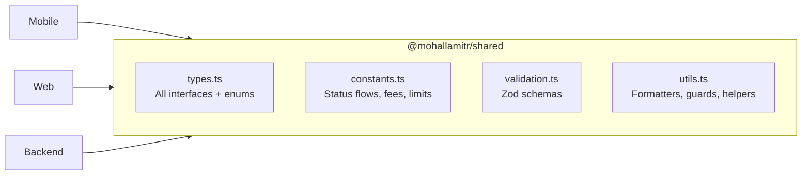

<details>
<summary><b>>>> Types — What's Defined</b></summary>

**Enums:** `UserRole` (4), `OrderStatus` (8), `PaymentMethod` (4), `PaymentTiming` (2), `PaymentStatus` (4), `BusinessCategory` (21)

**Interfaces:** Society, User (base), SuperAdmin, BusinessOwner, AppUser, DeliveryPartner, Business (with OperatingHours), Product, Order, OrderItem, Address, Review, Coupon, Refund, Notification, Message, ChatSession, HomeBanner, TrackingUpdate

**API types:** AuthCredentials, AuthToken, AuthResponse, ApiError, PaginationParams, PaginatedResponse\<T\>, CreateOrderPayload, CompleteDeliveryPayload

</details>

<details>
<summary><b>>>> Constants — The Rules</b></summary>

| Constant | Value | Used For |
|----------|-------|----------|
| `ORDER_ACCEPTANCE_WINDOW_SECONDS` | `60` | The famous timer |
| `ORDER_FEES.PLATFORM_FEE` | `₹2` | Added to every order |
| `ORDER_FEES.MINIMUM_ORDER` | `₹50` | Cart minimum |
| `ORDER_STATUS_FLOW` | Transition map | `canTransitionOrderStatus()` |
| `VALIDATION_LIMITS.PASSWORD` | 8–128 chars | Registration |
| `VALIDATION_LIMITS.PHONE` | 10 digits | Indian mobile |
| `VALIDATION_LIMITS.PINCODE` | 6 digits | Delivery address |
| `UPLOAD_LIMITS.MAX_FILE_SIZE` | 5 MB | S3 uploads |
| `UPLOAD_LIMITS.MAX_PRODUCT_IMAGES` | 5 | Product gallery |
| `DEFAULT_PAGINATION` | page 1, limit 20, max 100 | API listing |

</details>

<details>
<summary><b>>>> Validation — Zod Schemas</b></summary>

| Schema | Validates |
|--------|-----------|
| `authCredentialsSchema` | email + password (8-128) |
| `registerSchema` | + firstName, lastName, phone (`^[6-9]\d{9}$`) |
| `societySchema` | name, address, city, state, pincode |
| `businessSchema` | name, category, phone, address |
| `productSchema` | name, price, stock, category, imageUrls |
| `createOrderSchema` | businessId, items[], deliveryAddress, paymentMethod |
| `completeDeliverySchema` | Proof URL or data URI |
| `reviewSchema` | rating 1-5, comment 10-1000, max 3 images |
| `paginationSchema` | page, limit |
| `updateOrderStatusSchema` | Status transition |

Tests: Full coverage in `utils.test.ts` and `validation.test.ts` (~540 lines).

</details>

<details>
<summary><b>!!! Category Enum Mismatch</b></summary>

**Three different category lists exist:**

| Where | Count | Examples |
|-------|-------|---------|
| `types.ts` BusinessCategory enum | 21 | `grocery`, `fast_food`, `salon`, `gym` |
| `constants.ts` BUSINESS_CATEGORIES | 12 | `groceries`, `food`, `home_services` |
| Backend `shared/constants.ts` | 12 | Different again |
| Mongoose Business schema | 21 | Matches `types.ts` |
| Mobile `constants/` | 8 | `grocery`, `pharmacy`, `restaurant` |

**The slugs don't even match** (`grocery` vs `groceries`). Pick one source of truth.

</details>

---

## 9. Backend Route Map

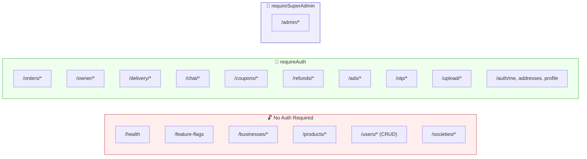

> **The red zone is the problem.** `/businesses`, `/products`, `/users`, and parts of `/societies` have **no auth middleware**. Anyone can CRUD them.

<details>
<summary><b>>>> Complete Endpoint Reference (60+ routes)</b></summary>

**Auth** (`/auth`)
| Method | Path | Auth | Purpose |
|--------|------|------|---------|
| POST | `/register` | — | Generic register (default role=user) |
| POST | `/user/register` | — | Resident register |
| POST | `/businessowner/register` | — | Owner + business (transaction) |
| POST | `/user/login` | — | Resident login |
| POST | `/businessowner/login` | — | Owner login |
| POST | `/deliverypartner/login` | — | Rider login |
| POST | `/superadmin/login` | — | Admin login |
| POST | `/refresh-token` | — | Rotate tokens |
| POST | `/logout` | — | Revoke refresh |
| GET | `/me` | Yes | Session restore |
| GET | `/home-feed` | Yes | Society businesses + products + banners |
| GET/POST/PUT/DELETE | `/addresses/me` | Yes | Delivery addresses CRUD |
| PUT | `/push-token` | Yes | Register OneSignal token |
| POST | `/change-password` | Yes | Password update |
| POST | `/verify-phone` | Yes | Mark phone verified |

**Orders** (`/orders`) — all authenticated
| Method | Path | Purpose |
|--------|------|---------|
| POST | `/` | Place order (stock deduction, coupon, 60s window) |
| GET | `/my` | User's orders (with lazy expiry check) |
| GET | `/business` | Owner's inbound orders |
| GET | `/:id` | Single order detail |
| PUT | `/:id/status` | Advance / cancel / reject |

**Owner** (`/owner`) — all authenticated
| Method | Path | Purpose |
|--------|------|---------|
| GET | `/business` | Own shop profile |
| GET/POST/PUT/DELETE | `/products` | Catalog CRUD |
| GET | `/orders` | Inbound order list |
| PATCH | `/orders/:id/status` | Accept (transactional 60s check) |
| POST | `/orders/:id/reject` | Reject + blacklist evaluation |
| PATCH | `/business/taking-orders` | Toggle accepting orders |
| PATCH | `/business/settings` | Update business settings |
| PATCH | `/business/image` | Update shop image |
| GET | `/analytics` | 7-day daily stats + popular items |
| GET | `/stats` | Summary stats |
| GET/POST/DELETE | `/coupons` | Coupon management |
| GET/POST/PATCH | `/delivery-partners` | Rider management |
| POST | `/orders/:id/assign-delivery-partner` | Assign rider to order |

**Delivery** (`/delivery`) — all authenticated
| Method | Path | Purpose |
|--------|------|---------|
| GET | `/orders` | Queue for partner's linked shop |
| GET | `/orders/:id` | Single order detail |
| POST | `/orders/:id/start` | ready → outForDelivery |
| POST | `/orders/:id/complete` | Proof image + payment → S3 |
| GET | `/me` | Rider profile |

**Admin** (`/admin`) — all requireSuperAdmin
| Method | Path | Purpose |
|--------|------|---------|
| GET | `/stats` | Dashboard KPIs |
| GET | `/orders` | God-mode order list |
| GET | `/societies` | Society list |
| GET | `/businesses` | Business list |
| GET | `/users` | User list |
| POST | `/businesses` | Create business + owner (temp password) |
| POST | `/business-owners` | Create owner account only |
| GET | `/products` | Approval queue |
| POST | `/products/:id/approve` | Green-light a SKU |
| POST | `/products/:id/reject` | Reject with note |
| POST | `/businesses/:id/verify` | Verify a shop |
| POST | `/businesses/:id/reject` | Reject a shop |
| POST | `/users/:id/suspend` | Ban user |
| POST | `/users/:id/activate` | Unban user |
| GET | `/blacklist` | Suspended businesses |
| GET | `/suspension-history` | Audit log |
| POST | `/businesses/:id/blacklist-suspend` | Manual suspend |
| POST | `/businesses/:id/blacklist-activate` | Unblock shop |
| GET/POST/PUT/DELETE | `/banners` | Home promo management |

**Other**
| Route | Auth | Purpose |
|-------|------|---------|
| `/reviews` GET | — | List reviews (by business/product) |
| `/reviews` POST | Yes | Submit review (delivered orders, one per order) |
| `/coupons/validate` POST | Yes | Validate coupon at checkout |
| `/coupons` GET | Yes | List available coupons |
| `/refunds/my` GET | Yes | My refund requests |
| `/refunds` POST | Yes | Request refund (48h window) |
| `/ads/claim-reward` POST | Yes | Claim rewarded-ad coupon (daily cap) |
| `/otp/send` POST | Yes | Send OTP (in-memory store!) |
| `/otp/verify` POST | Yes | Verify OTP |
| `/upload/profile` POST | Yes | Upload to S3 |
| `/chat` | Yes | Sessions + messages CRUD |
| `/societies` | — | CRUD (no auth on some!) |
| `/businesses` | — | Full CRUD (NO AUTH!) |
| `/products` | — | Full CRUD (NO AUTH!) |
| `/users` | — | CRUD (NO AUTH on list/write/delete!) |

</details>

---

## 10. Mobile Boot Sequence

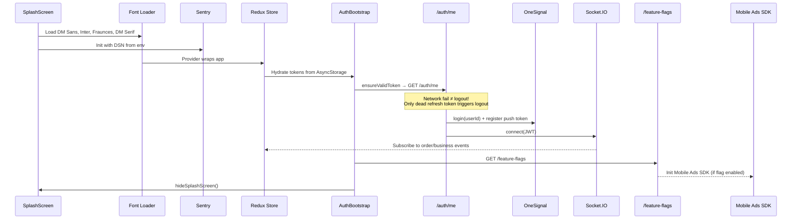

**Then the router decides where you go:**

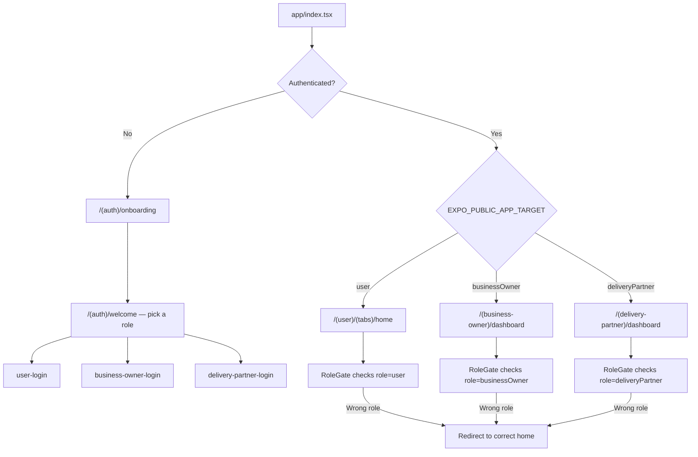

---

## 11. Deployment Topology

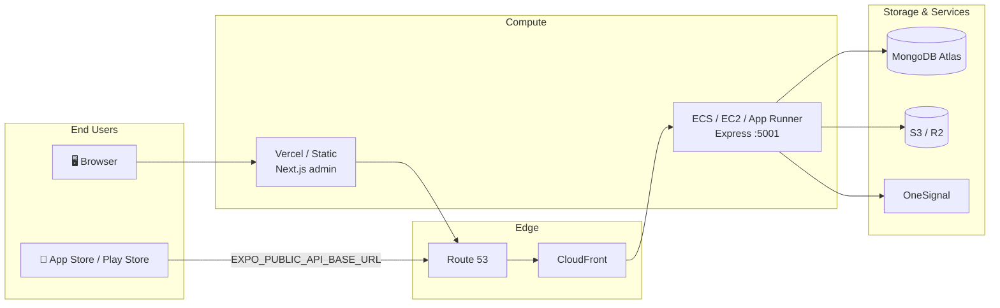

> **If REST is proxied under `/api` but `/socket.io` is not, orders will place but the UI feels dead.** Socket path must be on the same host.

<details>
<summary><b>>>> Environment Variables (Complete)</b></summary>

**Backend**
| Variable | Default | Purpose |
|----------|---------|---------|
| `MONGODB_URI` | — | Connection string |
| `PORT` | 5001 | Express port |
| `CORS_ORIGIN` | `*` | CORS policy (tighten in prod) |
| `JWT_ACCESS_SECRET` | — | Access token signing |
| `JWT_REFRESH_SECRET` | — | Refresh token signing |
| `JWT_ACCESS_EXPIRES_IN` | `"1h"` | Access token TTL |
| `ENABLE_MOCK_AUTH` | on unless `"false"` | **P0: MUST be "false" in prod** |
| `SUPER_ADMIN_EMAILS` | `ankushrishi5@gmail.com` | Admin allowlist |
| `S3_ENDPOINT` / `S3_REGION` / `S3_*` | — | Object storage |
| `S3_BUCKET` | `mohallamitr` | Default bucket |
| `ONESIGNAL_APP_ID` / `API_KEY` | — | Push service |
| `SYNC_INDEXES` | `true` | Run `syncIndexes()` on boot |
| `FF_ADS_ENABLED` | — | Master ads toggle |
| `FF_ADS_REWARDED_ENABLED` | — | Rewarded ad toggle |
| `FF_ADS_REWARDED_MIN_RS` / `MAX_RS` | 2 / 5 | Reward coupon range |
| `FF_ADS_REWARDED_MAX_CLAIMS_PER_DAY` | 1 | Daily cap |
| `FF_ADS_NATIVE_*` | — | Feed ad toggles |
| `FF_ADS_DENSITY_EVERY_NTH_CARD` | — | Ad frequency |

**Mobile (EXPO_PUBLIC_*)**
| Variable | Purpose |
|----------|---------|
| `EXPO_PUBLIC_API_BASE_URL` | Backend REST URL |
| `EXPO_PUBLIC_SOCKET_URL` | Backend Socket.IO URL |
| `EXPO_PUBLIC_APP_TARGET` | `user` / `businessOwner` / `deliveryPartner` |
| `EXPO_PUBLIC_SENTRY_DSN` | Error reporting |
| `EXPO_PUBLIC_ENABLE_SOCKET` | Socket toggle |

**Web**
| Variable | Purpose |
|----------|---------|
| `NEXT_PUBLIC_API_BASE_URL` | Backend REST URL (default: `http://127.0.0.1:5001`) |

</details>

---

## 12. Cross-Cutting Concerns

```
  ┌──────────────────────────────────────────────────────────┐
  │                   CROSS-CUTTING                          │
  │                                                          │
  │  Validation ─── Zod in shared + backend                  │
  │  Images ─────── POST /upload → S3 URL stored on docs     │
  │  Flags ──────── GET /feature-flags from FF_* env vars    │
  │  Errors ─────── Sentry on mobile (DSN from env)          │
  │  Ads ────────── Google Mobile Ads + rewarded coupons     │
  │  Chat ───────── REST messages, unique (business, user)   │
  │  Demo data ──── isDemo shops/products, auto-seed empty   │
  │  OTP ────────── In-memory store (lost on restart!)       │
  │  Cascade ────── Society delete wipes EVERYTHING below    │
  │  Push ───────── OneSignal (fire-and-forget)              │
  │  Coupons ────── percentage / flat / fixed, owner or ad   │
  │  Refunds ────── 48h window after delivery                │
  │                                                          │
  └──────────────────────────────────────────────────────────┘
```

<details>
<summary><b>>>> PrismaProxy — The Migration Scar</b></summary>

`lib/prismaProxy.ts` creates a JavaScript Proxy that maps Prisma-style calls to Mongoose:

| Prisma Call | Becomes |
|-------------|---------|
| `prisma.user.findUnique({ where: { id } })` | `User.findById(id)` |
| `prisma.order.findMany({ where: { status: { in: [...] } } })` | `Order.find({ status: { $in: [...] } })` |
| `prisma.$transaction(fn)` | Mongoose session + transaction |
| `prisma.user.create({ data: { ... } })` | `new User(data).save()` |

Operators mapped: `in`→`$in`, `notIn`→`$nin`, `contains`→`$regex`, `gt/gte/lt/lte`→`$gt/$gte/$lt/$lte`, `OR/AND/NOT`→`$or/$and/$nor`.

**New code should use Mongoose directly.** The proxy is a migration artifact, not a feature.

</details>

<details>
<summary><b>>>> Demo Catalog System</b></summary>

When a society has zero active businesses, `ensureSocietyDemoCatalog(societyId)` creates:

| Demo Shop | Category | Products |
|-----------|----------|----------|
| DailyFresh Mart | Grocery | 4 items |
| Spice Route Kitchen | Restaurant | 4 items |
| MediTrust Pharmacy | Pharmacy | 4 items |
| BrewBean Cafe | Cafe | 4 items |

Each with synthetic demo owners. All marked `isDemo: true`. **Don't "delete all demo" in prod without a plan.**

</details>

---

## 13. What Is Live vs. Folklore

| Story You Might Read | 2026 Reality |
|---------------------|-------------|
| ~~Firebase Cloud Functions API~~ | Replaced by `apps/backend` Express |
| ~~Firestore triggers~~ | Inlined as `orderEvents.ts`, `cascadeDelete.ts` |
| ~~Remote Config~~ | `GET /feature-flags` from env vars |
| ~~Prisma / Postgres~~ | Mongoose / MongoDB (`prismaProxy` is a migration scar) |
| ~~FCM push~~ | Dropped — OneSignal only |
| ~~Super admin on mobile~~ | Web dashboard only (`superAdminSlice` still in Redux — ignore it) |
| ~~Real UPI/card capture~~ | Not yet — payment method is a label |
| ~~Root DEVELOPMENT.md says use Firebase emulators~~ | Don't. Trust `apps/backend/` |
| ~~`apps/firebase/`~~ | **Do not deploy.** Legacy Cloud Functions |
| ~~axios, redux, react-hook-form, recharts in web~~ | Listed in package.json but **never imported** |

---

## 14. The Danger Board

```
  ╔═══════════════════════════════════════════════════════════════╗
  ║                    🔴 P0 — FIX BEFORE LAUNCH                ║
  ╠═══════════════════════════════════════════════════════════════╣
  ║                                                               ║
  ║  MOCK AUTH          ENABLE_MOCK_AUTH must be "false" in prod  ║
  ║                     Anyone can be anyone if left on            ║
  ║                                                               ║
  ║  OPEN CRUD          /businesses, /products, /users have       ║
  ║                     NO requireAuth — catalog vandalism risk   ║
  ║                                                               ║
  ║  APPROVAL UX        Owners think they published products;     ║
  ║                     residents see nothing until admin          ║
  ║                     approves on web → "empty app" tickets     ║
  ║                                                               ║
  ╠═══════════════════════════════════════════════════════════════╣
  ║                    🟡 P1 — BEFORE SCALE                      ║
  ╠═══════════════════════════════════════════════════════════════╣
  ║                                                               ║
  ║  PAYMENT GATEWAY    No Razorpay/Stripe — can't scale past    ║
  ║                     COD trust                                 ║
  ║                                                               ║
  ║  CATEGORY ENUMS     21 in types vs 12 in constants vs 12     ║
  ║                     in backend — filters will lie             ║
  ║                                                               ║
  ║  SOCKET PATH        Must share host with REST on LB or       ║
  ║                     "realtime broken" forever                 ║
  ║                                                               ║
  ╠═══════════════════════════════════════════════════════════════╣
  ║                    🔵 P2 — TECH DEBT                         ║
  ╠═══════════════════════════════════════════════════════════════╣
  ║                                                               ║
  ║  FIREBASE FOLDER    apps/firebase/ still in repo — new       ║
  ║                     hires will try to deploy the ghost        ║
  ║                                                               ║
  ║  WEB AUTH           Client-side only — XSS = god-mode JWT    ║
  ║                     Add middleware.ts server gate             ║
  ║                                                               ║
  ║  RATE LIMITS        /auth + /otp have no rate limiting       ║
  ║                     → SMS bill surprise + brute force        ║
  ║                                                               ║
  ║  OTP STORE          In-memory — lost on every restart        ║
  ║                     Move to Redis or Mongo                    ║
  ║                                                               ║
  ║  WEB PHANTOM DEPS   axios, redux, react-hook-form,           ║
  ║                     date-fns, recharts, lucide-react          ║
  ║                     listed but never imported                 ║
  ║                                                               ║
  ║  CRON PRECISION     Job is every minute — worst case          ║
  ║                     60-120s before auto-reject fires          ║
  ║                                                               ║
  ╚═══════════════════════════════════════════════════════════════╝
```

---

## 15. Quick Reference — Run Locally

```bash
# 1. Install everything
yarn install          # also runs patch-package

# 2. Build the shared treaty (required for typecheck)
cd packages/shared && yarn build && cd ../..

# 3. Start the backend
yarn backend:dev      # Express on :5001 → GET /health should smile

# 4. Pick a mobile flavor
yarn mobile:customer        # Resident app
yarn mobile:business        # Owner app
yarn mobile:delivery        # Rider app

# 5. Or start the web admin
yarn web                    # Next.js → http://localhost:3000
```

**First-time gotchas:**
- Backend needs `MONGODB_URI` in env (or local Mongo on default port)
- `ENABLE_MOCK_AUTH` is on by default — realtime/push won't work
- Mobile needs `EXPO_PUBLIC_API_BASE_URL` pointing at your backend
- Web needs `NEXT_PUBLIC_API_BASE_URL` (defaults to `http://127.0.0.1:5001`)

---

## 16. Choose a Door

```
  ┌─────────────────────────────────────────────────────────┐
  │                                                         │
  │  I want to...                   Go to...                │
  │                                                         │
  │  📱 Trace a tap to a component  → MOBILE.md             │
  │  🖥️  Verify a shop or unban     → WEB.md                │
  │  ⚙️  Change order rules          → BACKEND.md           │
  │  🗺️  Understand the whole thing  → You're already here  │
  │                                                         │
  └─────────────────────────────────────────────────────────┘
```

---

*Don't let a kirana wait more than a minute.*
