# Backend — The Nervous System

> Express on **:5001** · MongoDB via Mongoose · Socket.IO for gossip · node-cron for the 60-second reaper · OneSignal for push · S3 for blobs

[Architecture](./ARCHITECTURE.md) · [Mobile](./MOBILE.md) · [Web](./WEB.md)

---

## How it all fits together

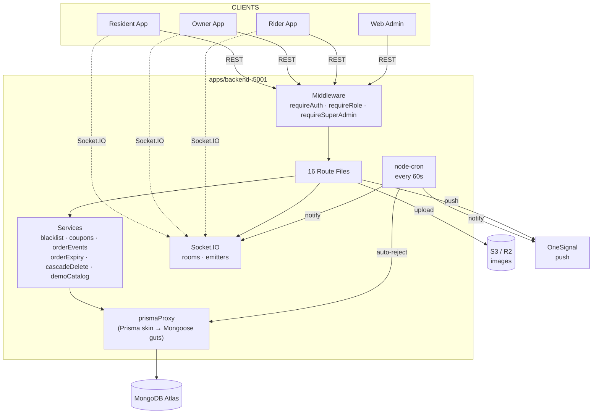

---

## Source map

```
apps/backend/src/
│
├── index.ts                    ← entry point, mounts everything
│
├── routes/                     ← 16 files, one per domain
│   ├── auth.ts                    identity + addresses + home-feed
│   ├── admin.ts                   super-admin kingdom
│   ├── orders.ts                  place + track + advance
│   ├── owner.ts                   shop cockpit
│   ├── delivery.ts                rider cockpit
│   ├── businesses.ts              ⚠️ OPEN CRUD
│   ├── products.ts                ⚠️ OPEN CRUD
│   ├── users.ts                   ⚠️ OPEN CRUD
│   ├── societies.ts               ⚠️ OPEN (cascade delete!)
│   ├── reviews.ts                 stars after delivery
│   ├── coupons.ts                 validate + list
│   ├── refunds.ts                 48h window
│   ├── ads.ts                     rewarded coupon claim
│   ├── otp.ts                     phone verify (in-memory!)
│   ├── upload.ts                  multipart → S3
│   └── chat.ts                    DM sessions + messages
│
├── models/index.ts             ← every Mongoose schema
├── middleware/                  ← auth.ts + superAdmin.ts
├── lib/                        ← jwt, notifications, prismaProxy, socket, storage
├── services/                   ← blacklist, cascadeDelete, coupons, demoCatalog, orderEvents, orderExpiry
├── jobs/autoRejectOrders.ts    ← the 60-second reaper
└── shared/                     ← constants.ts + validation.ts (zod)
```

---

## The Order — center of the universe

Everything exists to move an order from `pending` to `delivered` before the shop ghosts the resident.

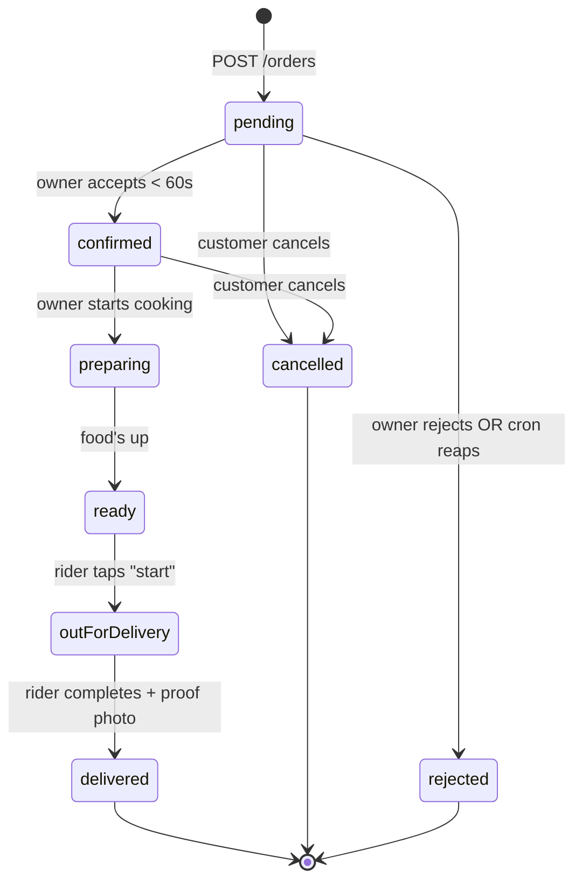

### What happens at each step

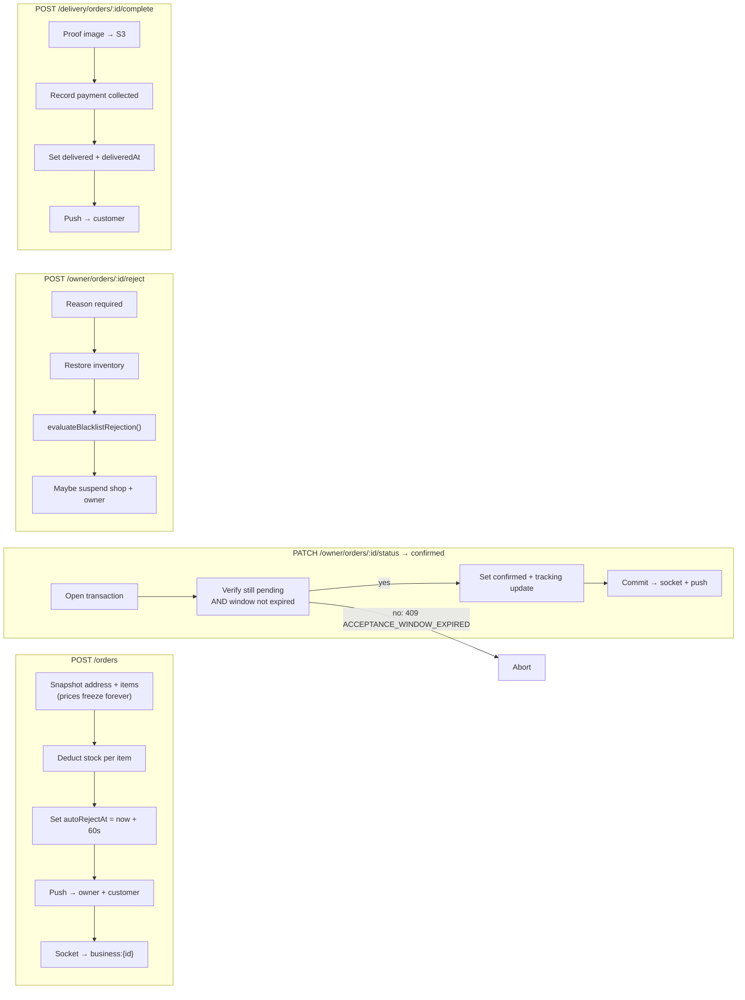

<details>
<summary><b>Money fields on an order</b></summary>

| Field | What |
|---|---|
| `subTotal` | Sum of line totals |
| `platformFee` | **₹2** flat |
| `couponCode` / `couponDiscount` | Applied coupon |
| `totalAmount` | Pre-discount |
| `finalAmount` | `subTotal + platformFee - couponDiscount` |
| `paymentMethod` | `cash` · `upi` · `card` · `wallet` |
| `paymentTiming` | `atOrder` or `atDelivery` |
| `paymentStatus` | `pending` · `completed` · `failed` · `cod` |

There is **no payment gateway**. Status is bookkeeping for COD / "I'll UPI the rider".

</details>

---

## The 60-Second Reaper (cron)

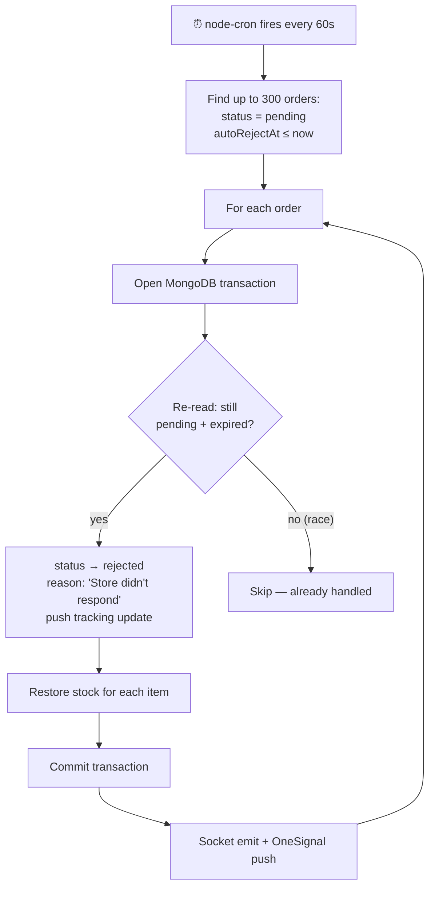

> Worst case: order waits **60–120s** (placed just after a tick). The cron is *every minute*, not *every 60 seconds from order creation*.

---

## The Blacklist Machine

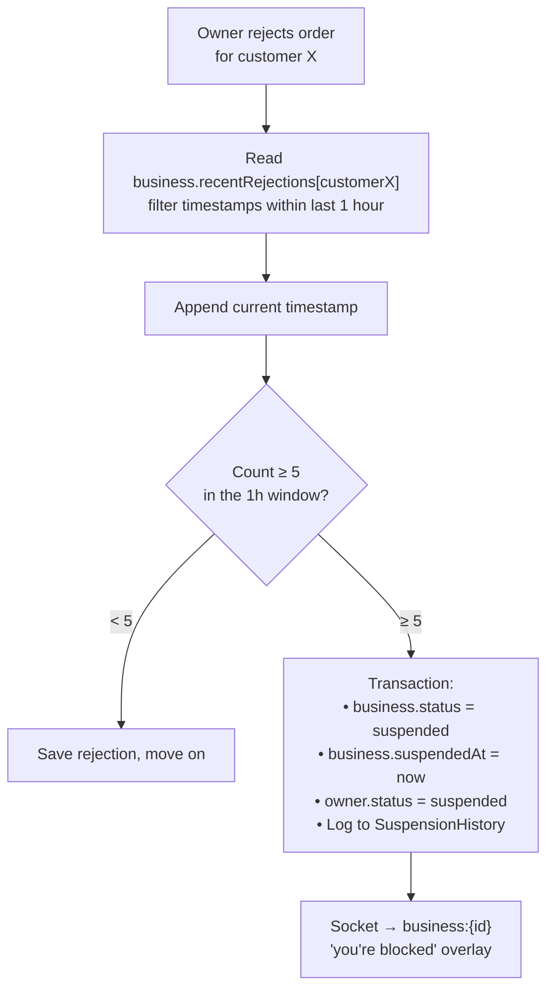

Key detail: the streak is **per customer**. Five rejects of five *different* customers in one hour does NOT trigger suspension.

---

## Identity & Auth

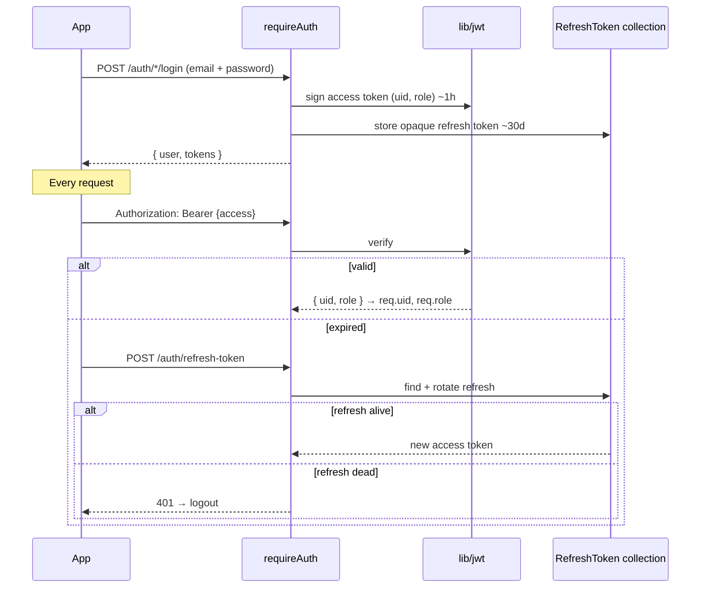

### Roles & what they unlock

| Role | Login endpoint | Client | Powers |
|---|---|---|---|
| `user` | `/auth/user/login` | Mobile (customer) | Browse, cart, order, chat, review, refund |
| `businessOwner` | `/auth/businessowner/login` | Mobile (owner) | Catalog, accept/reject, riders, coupons |
| `deliveryPartner` | `/auth/deliverypartner/login` | Mobile (rider) | Queue, start delivery, complete with proof |
| `superAdmin` | `/auth/superadmin/login` | **Web only** | Verify shops, approve SKUs, banners, unban |

### Middleware stack

| Guard | How it decides |
|---|---|
| `requireAuth` | Bearer JWT → verify → `req.uid` + `req.role`. **Bypassed** if `ENABLE_MOCK_AUTH !== "false"` and token is `mock-token-*` |
| `optionalAuth` | Same logic, but never blocks — `req.uid` is just `undefined` |
| `requireRole(...roles)` | After `requireAuth`, checks `req.role ∈ roles` |
| `requireSuperAdmin` | JWT role check → DB user role fallback → `SUPER_ADMIN_EMAILS` allowlist (default: `ankushrishi5@gmail.com`) |

---

## Realtime — Socket.IO rooms

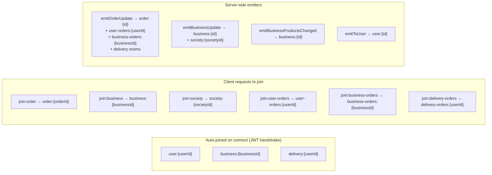

| Event emitted | Rooms hit | Triggered by |
|---|---|---|
| `order:updated` | `order:{id}` | Any status change |
| `orders:user:updated` | `user-orders:{userId}` | Order status change |
| `orders:business:updated` | `business-orders:{businessId}` | Order status change |
| `orders:delivery:updated` | `delivery-orders:{riderId}` | Order assigned/changed |
| `business:updated` | `business:{id}` + `society:{societyId}` | Business profile change |
| `business:products:changed` | `business:{id}` | Product CRUD |

---

## Data Village — ER diagram

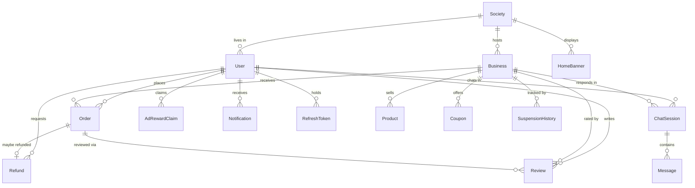

**Order is the star.** Everything else exists to shepherd it from `pending` → `delivered`.

Frozen on place: item names, prices, address snapshot, shop name. Later catalog edits cannot rewrite history.

<details>
<summary><b>Society</b></summary>

| Field | Type | Notes |
|---|---|---|
| `name` | String* | |
| `address` | String* | |
| `city` | String* | |
| `state` | String* | |
| `pincode` | String* | |
| `description` | String | |
| `imageUrl` | String | |
| `createdBy` | ObjectId | |
| `status` | String | `"active"` (default) |
| `totalUsers` | Number | Default 0 |

</details>

<details>
<summary><b>User</b></summary>

| Field | Type | Notes |
|---|---|---|
| `firstName` | String* | |
| `lastName` | String* | |
| `email` | String* | Unique, lowercase |
| `passwordHash` | String* | bcrypt |
| `phone` | String* | Unique |
| `role` | String* | `superAdmin` · `businessOwner` · `user` · `deliveryPartner` |
| `societyId` | ObjectId | Indexed |
| `profileImageUrl` | String | |
| `isEmailVerified` | Boolean | Default `false` |
| `isPhoneVerified` | Boolean | Default `false` |
| `status` | String | `active` · `inactive` · `suspended` |
| `disabled` | Boolean | Default `false` |
| `mustChangePassword` | Boolean | Default `false` |
| `verificationStatus` | String | `null` → `pending` · `verified` · `rejected` |
| `favoriteBusinesses` | [ObjectId] | |
| `pushToken` | String | OneSignal |
| `fcmToken` | String | Legacy |
| `businessId` | ObjectId | For delivery partners |
| `ownerId` | ObjectId | For delivery partners |
| `businessName/Address/Phone/ImageUrl/Category` | String | Denormalized owner fields |
| `addresses` | [Address] | Subdocument array |

**Indexes:** `{societyId, role}`

</details>

<details>
<summary><b>Business</b></summary>

| Field | Type | Notes |
|---|---|---|
| `name` | String* | |
| `category` | String* | 21-value enum (grocery, pharmacy, restaurant, fast_food, cafe, bakery, dairy, fruits_vegetables, meat_seafood, sweets_mithai, electronics, hardware, toy_shop, stationery, flowers, clothing, fashion_accessories, pet_supplies, salon, gym, other) |
| `description` | String | |
| `ownerId` | ObjectId* | Unique, indexed |
| `societyId` | ObjectId* | Indexed |
| `imageUrl` / `bannerUrl` | String | |
| `phone` | String* | |
| `email` | String | |
| `address` | String* | |
| `rating` | Number | Default 0 |
| `totalReviews` | Number | Default 0 |
| `status` | String | `active` · `inactive` · `suspended` |
| `isVerified` | Boolean | Default `false` — admin must verify |
| `isTakingOrders` | Boolean | Default `true` |
| `minimumOrderAmount` / `estimatedDeliveryTime` / `preparationTime` / `deliveryFee` | Number | |
| `tags` | [String] | |
| `rejectionReason` | String | |
| `suspendedAt` / `suspensionReason` | Date / String | |
| `recentRejections` | Mixed | `{ [userId]: [timestamps] }` |
| `isDemo` | Boolean | Seed data flag |

**Indexes:** `{societyId, status}`, `{category}`

</details>

<details>
<summary><b>Product</b></summary>

| Field | Type | Notes |
|---|---|---|
| `businessId` | ObjectId* | Indexed |
| `name` | String* | |
| `description` | String | |
| `category` | String* | |
| `menuSection` | String | |
| `isVeg` | Boolean | |
| `tags` | [String] | |
| `price` | Number* | |
| `originalPrice` | Number | |
| `discount` | Number | Default 0 |
| `imageUrls` | [String] | |
| `stock` | Number | Default 0 |
| `unit` | String | piece / g / kg / ml / L |
| `unitStep` | Number | |
| `rating` / `totalReviews` | Number | Default 0 |
| `status` | String | `active` · `inactive` |
| `isVerified` | Boolean | Default `false` |
| `approvalStatus` | String | `pending` · `approved` · `rejected` |
| `approvalNote` | String | |
| `availableToday` | Boolean | Default `true` |
| `attributes` | Mixed | |
| `isDemo` | Boolean | |

**Indexes:** `{businessId, status}`, `{businessId, category}`

</details>

<details>
<summary><b>Order</b></summary>

| Field | Type | Notes |
|---|---|---|
| `userId` | ObjectId* | Indexed |
| `userName` / `userPhone` | String | Denormalized |
| `businessId` | ObjectId* | Indexed |
| `businessName` | String | Denormalized |
| `items` | [OrderItem]* | `{ productId, productName, productImage, quantity, price, lineTotal }` |
| `subTotal` / `platformFee` / `couponDiscount` / `totalAmount` / `finalAmount` | Number | |
| `couponCode` | String | |
| `addressId` | ObjectId | |
| `deliveryAddressSnapshot` | Mixed* | Frozen at order time |
| `status` | String | Full lifecycle enum |
| `paymentMethod` | String* | `cash` · `card` · `upi` · `wallet` |
| `paymentTiming` | String | `atOrder` · `atDelivery` |
| `paymentStatus` | String* | `pending` · `completed` · `failed` · `cod` |
| `notes` | String | |
| `trackingUpdates` | [TrackingUpdate] | `{ status, timestamp, notes, rejectionReason, rejectedBy }` |
| `acceptanceWindowSeconds` | Number | Default 60 |
| `autoRejectAt` | Date | `now + 60s` |
| `assignedDeliveryPartnerId` / `Name` / `At` | Mixed | |
| `deliveredAt` / `deliveredBy` | Date / String | |
| `deliveryProofImageUrl` | String | |
| `paymentCollectedAt` / `By` / `Method` | Mixed | |
| `rejectionReason` / `rejectedAt` / `rejectedBy` | Mixed | `rejectedBy`: `"business_owner"` or `"system"` |
| `refundRequested` | Boolean | Default `false` |

**Indexes:** `{businessId, status, createdAt:-1}`, `{businessId, createdAt:-1}`, `{userId, createdAt:-1}`, `{status, createdAt:-1}`, `{status, autoRejectAt}`

</details>

<details>
<summary><b>Coupon · Refund · Review · Notification · HomeBanner · Chat · Ads · Suspension</b></summary>

**Coupon:** `code`*(unique, uppercase), `type`*(percentage/flat/fixed), `value`*, `minOrderAmount`(0), `maxDiscount`, `businessId`, `usageLimit`, `usageCount`(0), `perUserLimit`, `couponSource`(owner/rewarded_ad), `forUserId`(personal coupons), `expiresAt`, `status`

**Refund:** `orderId`*(unique), `userId`*, `businessId`*, `businessName`, `orderAmount`*, `reason`*(wrong_item/missing_item/quality_issue/damaged/other), `comment`*, `status`(pending/approved/rejected/processed), `refundAmount`

**Review:** `userId`*, `businessId`, `productId`, `orderId`*, `rating`*(1-5), `title`, `comment`*, `imageUrls`[], `verified`(true), `helpful`/`notHelpful`, `status`

**Notification:** `userId`*, `type`*(order/promotion/system/message), `title`*, `body`*, `data`(Mixed), `read`(false)

**HomeBanner:** `title`*, `subtitle`, `imageUrl`*, `tagText`("TRENDING IN YOUR SOCIETY"), `ctaText`, `ctaRoute`, `societyId`(null = global), `isActive`(true), `sortOrder`(100), `startAt`/`endAt`, `theme`(Mixed)

**ChatSession:** `businessId`* + `userId`* (unique pair), `businessOwnerId`*, `businessName`, `lastMessage`, `lastMessageAt`

**Message:** `chatSessionId`*, `senderId`*, `receiverId`*, `content`*, `type`(text/image/file), `read`(false)

**AdRewardClaim:** `userId`* + `date`*(YYYY-MM-DD) unique, `count`(0), `lastClaimedAt`

**SuspensionHistory:** `action`*(suspended/activated), `entityType`("business"), `entityId`*, `entityName`, `ownerId`, `reason`, `performedBy`*

**RefreshToken:** `token`*(unique), `userId`*, `expiresAt`*, `revoked`(false)

**PasswordResetToken:** `token`*(unique), `userId`*, `expiresAt`*, `usedAt`

</details>

---

## Every endpoint, every door

### `/auth` — Identity

| Method | Path | Auth | What it does |
|---|---|---|---|
| `POST` | `/auth/register` | — | Generic register (default role=user) |
| `POST` | `/auth/user/register` | — | Resident register |
| `POST` | `/auth/businessowner/register` | — | Owner + business in one transaction |
| `POST` | `/auth/user/login` | — | Resident login |
| `POST` | `/auth/businessowner/login` | — | Owner login |
| `POST` | `/auth/deliverypartner/login` | — | Rider login |
| `POST` | `/auth/superadmin/login` | — | Admin login (email allowlist) |
| `POST` | `/auth/refresh-token` | — | Rotate refresh → new access |
| `POST` | `/auth/logout` | — | Revoke refresh token |
| `GET` | `/auth/me` | `requireAuth` | Session restore |
| `GET` | `/auth/profile/me` | `requireAuth` | Profile data |
| `PUT` | `/auth/profile/me` | `requireAuth` | Update profile |
| `POST` | `/auth/change-password` | `requireAuth` | Change password |
| `GET` | `/auth/home-feed` | `requireAuth` | Society businesses + products + banners |
| `GET` | `/auth/addresses/me` | `requireAuth` | List addresses |
| `POST` | `/auth/addresses/me` | `requireAuth` | Add address |
| `PUT` | `/auth/addresses/:addressId` | `requireAuth` | Update address |
| `DELETE` | `/auth/addresses/:addressId` | `requireAuth` | Delete address |
| `PUT` | `/auth/addresses/:addressId/set-default` | `requireAuth` | Set default address |
| `POST` | `/auth/verify-phone` | `requireAuth` | Mark phone verified |
| `PUT` | `/auth/push-token` | `requireAuth` | Register OneSignal token |

### `/admin` — Super Admin kingdom

> Every route here requires `requireSuperAdmin`.

| Method | Path | What it does |
|---|---|---|
| `GET` | `/admin/stats` | KPI dashboard numbers |
| `GET` | `/admin/orders` | God-mode order list |
| `GET` | `/admin/societies` | All societies |
| `GET` | `/admin/businesses` | All shops |
| `GET` | `/admin/users` | All users |
| `GET` | `/admin/products` | Approval queue (filter by status) |
| `GET` | `/admin/blacklist` | Suspended businesses |
| `GET` | `/admin/suspension-history` | Audit trail |
| `GET` | `/admin/banners` | All banners |
| `POST` | `/admin/businesses` | Create business + owner (temp password) |
| `POST` | `/admin/business-owners` | Create owner account only |
| `POST` | `/admin/products/:id/approve` | Green-light a product |
| `POST` | `/admin/products/:id/reject` | Reject with note |
| `POST` | `/admin/businesses/:id/verify` | Verify a shop |
| `POST` | `/admin/businesses/:id/reject` | Reject a shop |
| `POST` | `/admin/users/:id/suspend` | Ban user |
| `POST` | `/admin/users/:id/activate` | Unban user |
| `POST` | `/admin/businesses/:id/blacklist-suspend` | Manual suspend |
| `POST` | `/admin/businesses/:id/blacklist-activate` | Unblock auto-suspended shop |
| `POST` | `/admin/banners` | Create banner |
| `PUT` | `/admin/banners/:id` | Update banner |
| `DELETE` | `/admin/banners/:id` | Delete banner |

### `/orders` — The main event

| Method | Path | Auth | What |
|---|---|---|---|
| `POST` | `/orders` | `requireAuth` | **Place order** (stock deduction, coupon, 60s window) |
| `GET` | `/orders/my` | `requireAuth` | My orders (lazy expiry on read) |
| `GET` | `/orders/business` | `requireAuth` | Business's orders |
| `GET` | `/orders/:id` | `requireAuth` | Single order |
| `GET` | `/orders` | `requireAuth` | List all (admin/filtered) |
| `PUT` | `/orders/:id/status` | `requireAuth` | Advance / cancel / reject |

### `/owner` — Shop cockpit

| Method | Path | What |
|---|---|---|
| `GET` | `/owner/business` | My shop profile |
| `GET` | `/owner/products` | My catalog |
| `POST` | `/owner/products` | Add product (starts `pending`) |
| `PUT` | `/owner/products/:id` | Edit product |
| `DELETE` | `/owner/products/:id` | Remove product |
| `GET` | `/owner/orders` | Inbound orders |
| `PATCH` | `/owner/orders/:orderId/status` | **Accept** (transactional 60s check) |
| `POST` | `/owner/orders/:orderId/reject` | **Reject** (blacklist-aware + inventory restore) |
| `POST` | `/owner/orders/:orderId/assign-delivery-partner` | Assign rider |
| `GET` | `/owner/analytics` | 7-day daily stats + popular items |
| `GET` | `/owner/stats` | Quick numbers |
| `POST` | `/owner/coupons` | Create coupon |
| `GET` | `/owner/coupons` | List coupons |
| `DELETE` | `/owner/coupons/:id` | Remove coupon |
| `GET` | `/owner/delivery-partners` | My riders |
| `POST` | `/owner/delivery-partners` | Register rider |
| `PATCH` | `/owner/delivery-partners/:id` | Update rider |
| `PATCH` | `/owner/business/taking-orders` | Toggle shop open/closed |
| `PATCH` | `/owner/business/settings` | Update shop settings |
| `PATCH` | `/owner/business/image` | Update shop image |

### `/delivery` — Rider cockpit

| Method | Path | What |
|---|---|---|
| `GET` | `/delivery/orders` | Queue for linked shop |
| `GET` | `/delivery/orders/:id` | Single order |
| `POST` | `/delivery/orders/:id/start` | `ready` → `outForDelivery` |
| `POST` | `/delivery/orders/:id/complete` | Proof image + payment → `delivered` |
| `GET` | `/delivery/me` | Rider profile |

<details>
<summary><b>Supporting routes (reviews, coupons, refunds, ads, otp, upload, chat, misc)</b></summary>

### `/businesses` · `/products` · `/users` · `/societies`

> **These four have NO AUTH on their CRUD operations.** Legacy from Firebase migration. Lock them down or explicitly sign off.

| Route file | Endpoints | Auth |
|---|---|---|
| `businesses.ts` | `GET /` · `GET /:id` · `POST /` · `PUT /:id` · `DELETE /:id` | **NONE** |
| `products.ts` | `GET /` · `GET /:id` · `POST /` · `PUT /:id` · `DELETE /:id` | **NONE** |
| `users.ts` | `GET /` · `GET /:id` · `PUT /:id` · `DELETE /:id` | **NONE** |
| `users.ts` | `GET/PUT/POST/DELETE` profile + addresses + verify-phone compat routes | `requireAuth` |
| `societies.ts` | `GET /` · `GET /:id` · `POST /` · `PUT /:id` · `DELETE /:id` (cascade!) | **NONE** |

### `/reviews`

| Method | Path | Auth | What |
|---|---|---|---|
| `GET` | `/reviews` | — | Public (by businessId or productId) |
| `POST` | `/reviews` | `requireAuth` | One review per delivered order, rating 1-5 |

### `/coupons`

| Method | Path | Auth | What |
|---|---|---|---|
| `POST` | `/coupons/validate` | `requireAuth` | Check code against business + min amount + limits |
| `GET` | `/coupons` | `requireAuth` | List available coupons |

### `/refunds`

| Method | Path | Auth | What |
|---|---|---|---|
| `GET` | `/refunds/my` | `requireAuth` | My refund requests |
| `POST` | `/refunds` | `requireAuth` | Request refund (delivered orders only, **48h window**) |

### `/ads`

| Method | Path | Auth | What |
|---|---|---|---|
| `POST` | `/ads/claim-reward` | `requireAuth` | Watch ad → personal coupon (daily cap from flags) |

### `/otp`

| Method | Path | Auth | What |
|---|---|---|---|
| `POST` | `/otp/send` | `requireAuth` | Send OTP (**in-memory store** — lost on restart) |
| `POST` | `/otp/verify` | `requireAuth` | Verify → `isPhoneVerified = true` |

### `/upload`

| Method | Path | Auth | What |
|---|---|---|---|
| `POST` | `/upload/profile` | `requireAuth` | Multipart → S3 |
| `POST` | `/upload/delete` | `requireAuth` | Delete by URL |

### `/chat`

| Method | Path | Auth | What |
|---|---|---|---|
| All | `/chat/*` | `requireAuth` | Session CRUD + messages (unique per business+user pair) |

### Root

| Method | Path | What |
|---|---|---|
| `GET` | `/health` | Heartbeat |
| `GET` | `/feature-flags` | Returns `FF_*` env vars as JSON |

</details>

---

## Services — the brain behind the routes

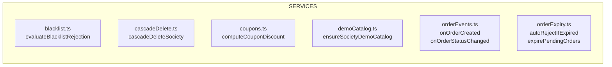

| Service | What it does |
|---|---|
| **blacklist** | `evaluateBlacklistRejection(businessId, customerId, ownerUid)` — transaction: read `recentRejections[customer]`, filter within 1h, append. If count ≥ 5 → suspend business + owner + log history |
| **cascadeDelete** | `cascadeDeleteSociety(societyId)` — nuclear: orders → products → coupons → reviews → businesses → owner accounts → society |
| **coupons** | `computeCouponDiscount(uid, code, subTotal, businessId)` — validates active/not-expired/correct-business/min-amount/usage-limits. Percentage: `floor(sub * value / 100)` capped by `maxDiscount`. Flat/fixed: `min(value, subTotal)` |
| **demoCatalog** | If society has 0 active businesses → seeds 4 demo shops (DailyFresh Mart, Spice Route Kitchen, MediTrust Pharmacy, BrewBean Cafe) with 4 products each |
| **orderEvents** | `onOrderCreated` → push to customer + owner. `onOrderStatusChanged` → push status update to customer. `onUserWelcome` → welcome notification |
| **orderExpiry** | `autoRejectIfExpired` — transactional: verify pending + expired, reject, restore inventory. `expirePendingOrders` — lazy expiry called on list endpoints |

### Cascade delete visualized

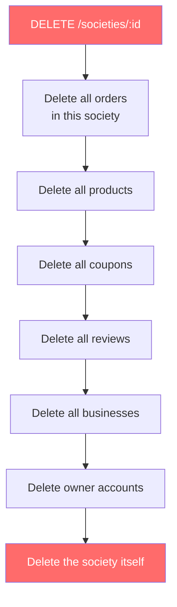

> This route has **no auth guard** and **no confirmation**. It's not a toy button.

---

## The PrismaProxy — the translation layer

`lib/prismaProxy.ts` wraps Mongoose behind a Prisma-like API. It exists because the codebase was migrated from a Prisma/Postgres plan to Mongoose/MongoDB, and changing every call site wasn't worth it.

**How it works:**

```
Your code says:          prisma.business.findMany({ where: { societyId, status: "active" } })
                                    ↓
PrismaProxy translates:  Business.find({ societyId, status: "active" })
                                    ↓
Mongoose executes:       db.businesses.find({ societyId: ..., status: "active" })
```

**Key translations:**

| Prisma | → | MongoDB/Mongoose |
|---|---|---|
| `id` | → | `_id` |
| `{ in: [...] }` | → | `{ $in: [...] }` |
| `{ contains: "x" }` | → | `{ $regex: "x", $options: "i" }` |
| `{ gt, gte, lt, lte }` | → | `{ $gt, $gte, $lt, $lte }` |
| `{ OR: [...] }` | → | `{ $or: [...] }` |
| `{ NOT: {...} }` | → | `{ $nor: [...] }` |
| `prisma.$transaction(fn)` | → | Mongoose session + transaction |

**For new code:** use `models` and Mongoose directly. The proxy is a migration scar, not a feature.

---

## Environment variables

<details>
<summary><b>Full env var reference</b></summary>

| Variable | Default | What |
|---|---|---|
| `MONGODB_URI` | — | MongoDB connection string |
| `PORT` | `5001` | Server port |
| `CORS_ORIGIN` | `*` | **Tighten for production** |
| `JWT_ACCESS_SECRET` | — | Access token signing key |
| `JWT_REFRESH_SECRET` | — | Refresh token signing key |
| `JWT_ACCESS_EXPIRES_IN` | `"1h"` | Access token TTL |
| `ENABLE_MOCK_AUTH` | enabled | **Must be `"false"` in production** |
| `SUPER_ADMIN_EMAILS` | `ankushrishi5@gmail.com` | Comma-separated admin allowlist |
| `S3_ENDPOINT` | — | S3-compatible endpoint |
| `S3_REGION` | — | Bucket region |
| `S3_FORCE_PATH_STYLE` | — | MinIO compatibility |
| `S3_ACCESS_KEY_ID` | — | IAM key |
| `S3_SECRET_ACCESS_KEY` | — | IAM secret |
| `S3_BUCKET` | `"mohallamitr"` | Bucket name |
| `S3_PUBLIC_BASE_URL` | — | Public URL prefix for files |
| `ONESIGNAL_APP_ID` | — | Push app ID |
| `ONESIGNAL_API_KEY` | — | Push API key |
| `FF_ADS_ENABLED` | — | Master ads toggle |
| `FF_ADS_NATIVE_FEED_ENABLED` | — | Native feed ads |
| `FF_ADS_NATIVE_LISTING_ENABLED` | — | Native listing ads |
| `FF_ADS_REWARDED_ENABLED` | — | Rewarded ads |
| `FF_ADS_REWARDED_MIN_RS` | `2` | Min reward ₹ |
| `FF_ADS_REWARDED_MAX_RS` | `5` | Max reward ₹ |
| `FF_ADS_DENSITY_EVERY_NTH_CARD` | — | Ad card frequency |
| `FF_ADS_REWARDED_MAX_CLAIMS_PER_DAY` | `1` | Daily claim cap |
| `SYNC_INDEXES` | `true` | Run syncIndexes on boot |
| `NODE_ENV` | — | Environment |

</details>

### Hard-coded constants

| Constant | Value | Lives in |
|---|---|---|
| `ORDER_ACCEPTANCE_WINDOW_SECONDS` | `60` | shared/constants.ts |
| `PLATFORM_FEE` | `₹2` | shared/constants.ts |
| `MINIMUM_ORDER` | `₹50` | shared/constants.ts |
| `BLACKLIST_REJECTION_LIMIT` | `5` | shared/constants.ts |
| `BLACKLIST_WINDOW_MS` | `3,600,000` (1 hour) | shared/constants.ts |
| `REFUND_WINDOW_HOURS` | `48` | shared/constants.ts |
| `AD_REWARD_MAX_CLAIMS_PER_DAY` | `1` | shared/constants.ts |
| `AD_REWARD_MIN/MAX_RS` | `₹2 / ₹5` | shared/constants.ts |

---

## Landmines — ranked by blast radius

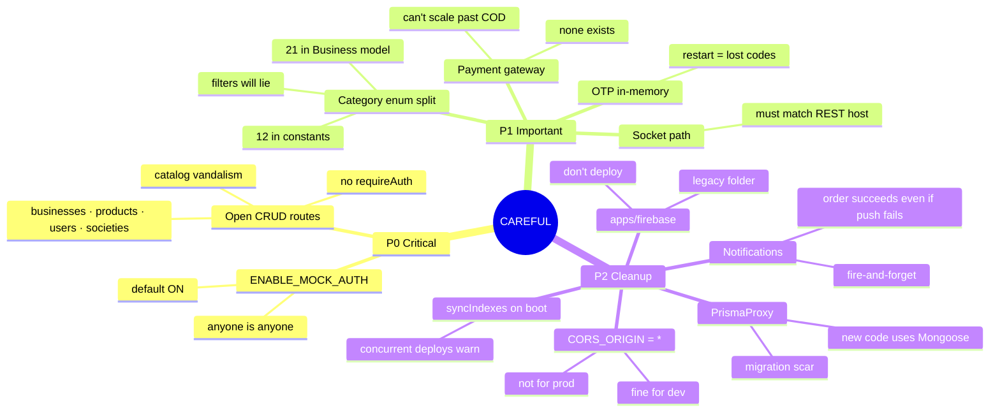

| Priority | Landmine | What happens if you ignore it |
|---|---|---|
| **P0** | `ENABLE_MOCK_AUTH` is ON by default | Any `mock-token-*` bearer bypasses auth. **Anyone is anyone in production** |
| **P0** | `businesses.ts` / `products.ts` / `users.ts` / `societies.ts` have **no `requireAuth`** | Anonymous CRUD on your entire catalog, user list, and societies. Copied from old Firebase setup |
| **P0** | `DELETE /societies/:id` cascade-deletes **everything** | Orders, products, coupons, reviews, businesses, owner accounts — all gone. No auth, no confirmation |
| **P1** | Business schema has 21 categories, constants has 12 | UI filter dropdown doesn't match DB. Shops with "fast_food" won't show under "food" |
| **P1** | No payment gateway | `paymentMethod` is just a label. Can't verify UPI/card actually happened |
| **P1** | OTP uses in-memory store | Server restart = all pending OTPs vanish. Move to Redis or DB |
| **P1** | Socket path must live on same host as REST | If load balancer routes `/socket.io` differently, orders place but UI never updates |
| **P2** | `apps/firebase` still in repo | Legacy Cloud Functions. New hires might deploy the ghost |
| **P2** | `CORS_ORIGIN = *` in dev | Fine locally, but ship it and any origin can call your API |
| **P2** | PrismaProxy | Works but is a translation layer. New code should use Mongoose models directly |
| **P2** | `syncIndexes()` on boot | Multiple concurrent deploys may warn — usually harmless |
| **P2** | Push notifications are fire-and-forget | Order write succeeds even if OneSignal is down. Customer just doesn't get pinged |

<details>
<summary><b>Quick self-test</b></summary>

1. Owner accepts at t=61s. What status code?
   **`409 ACCEPTANCE_WINDOW_EXPIRED`** (if the order is still pending).

2. Five rejects — five *different* customers — one hour. Suspended?
   **No.** The streak counter is per-customer: `recentRejections[customerId]`.

3. Where did Prisma schema go?
   **It never existed.** Mongo schemas live in `models/index.ts`. "Prisma" is a nickname for the proxy that maps Prisma-style calls to Mongoose.

4. You restart the server. What breaks?
   **In-memory OTP store is wiped.** Anyone mid-verification has to resend.

5. Anonymous user sends `DELETE /societies/abc123`. What happens?
   **Everything in that society is deleted.** No auth guard on that route.

</details>
