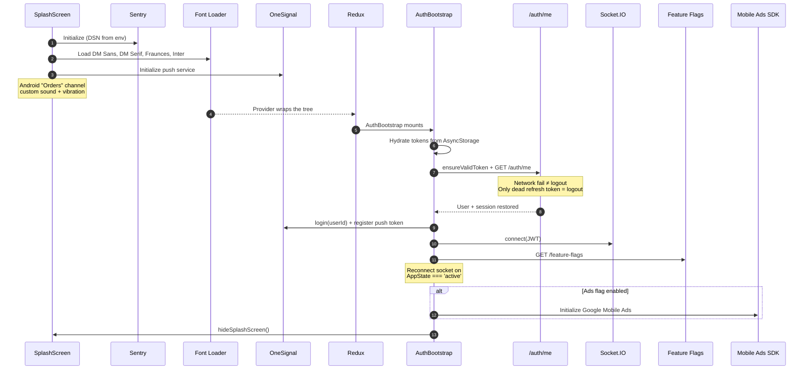
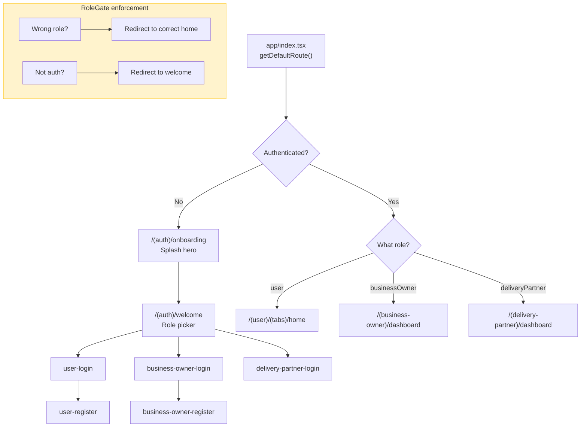
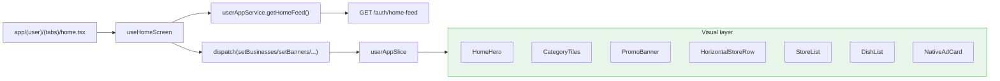
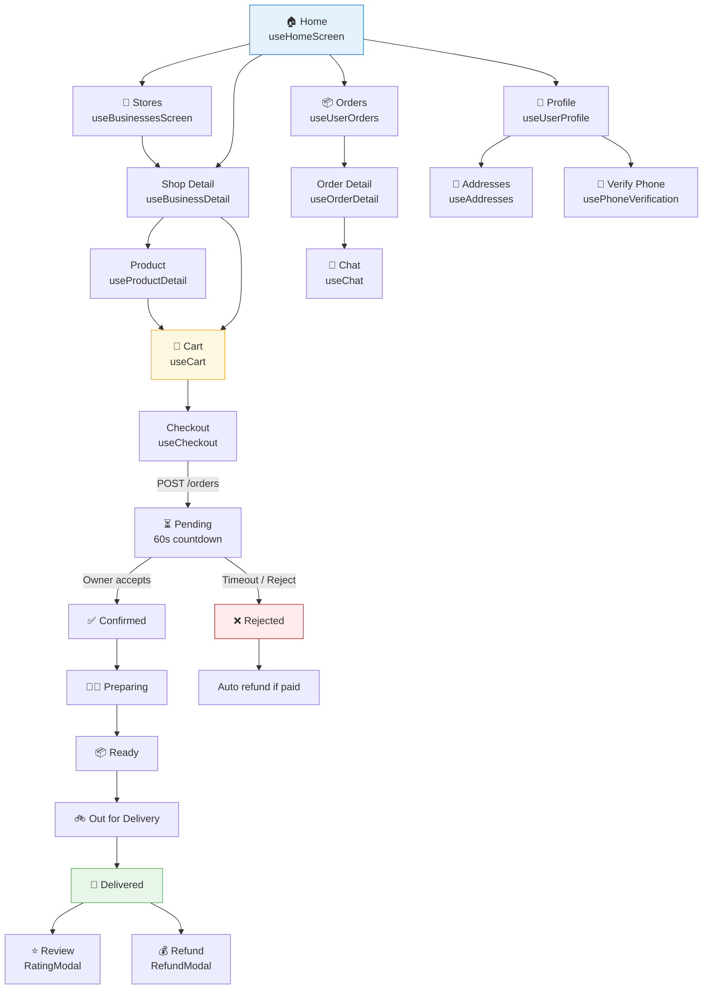
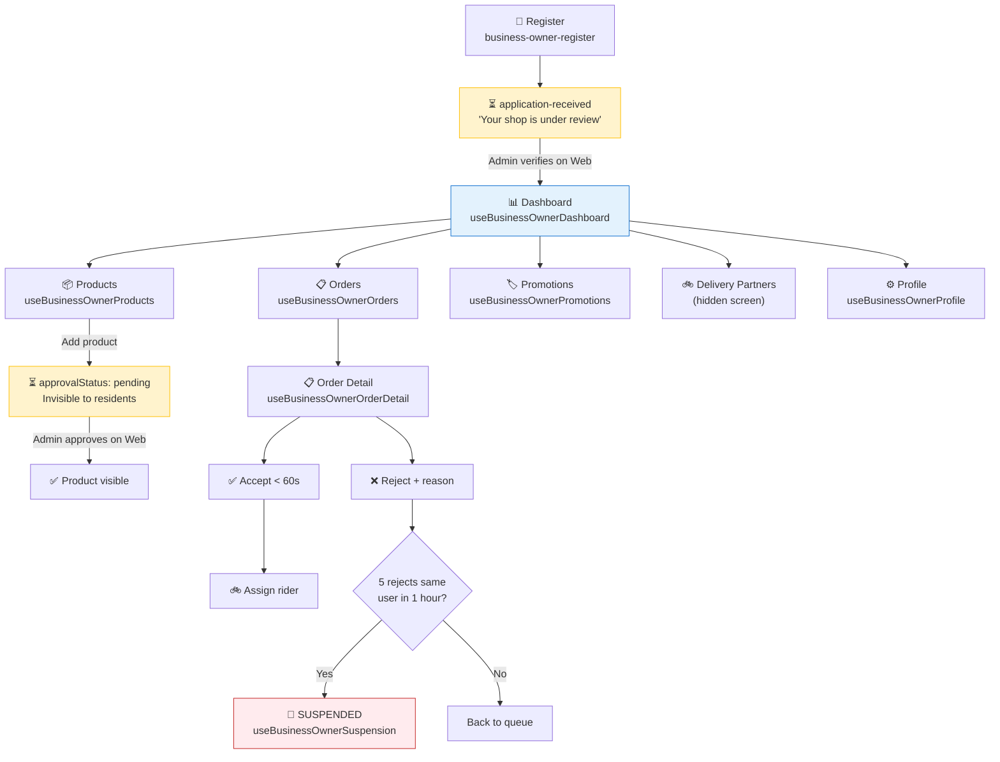
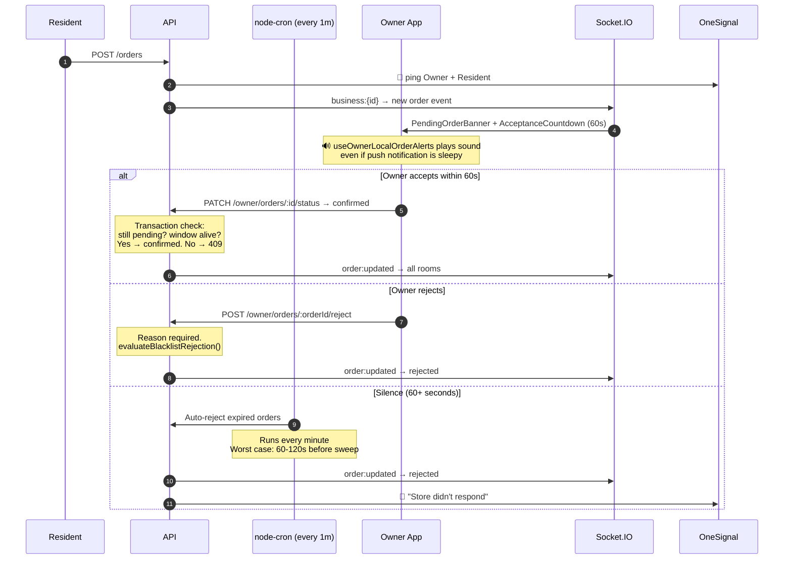
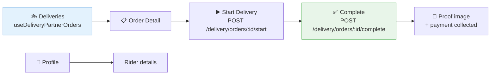
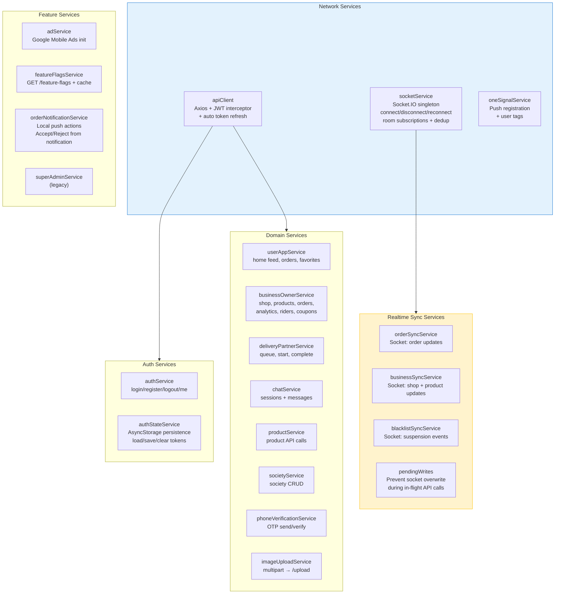
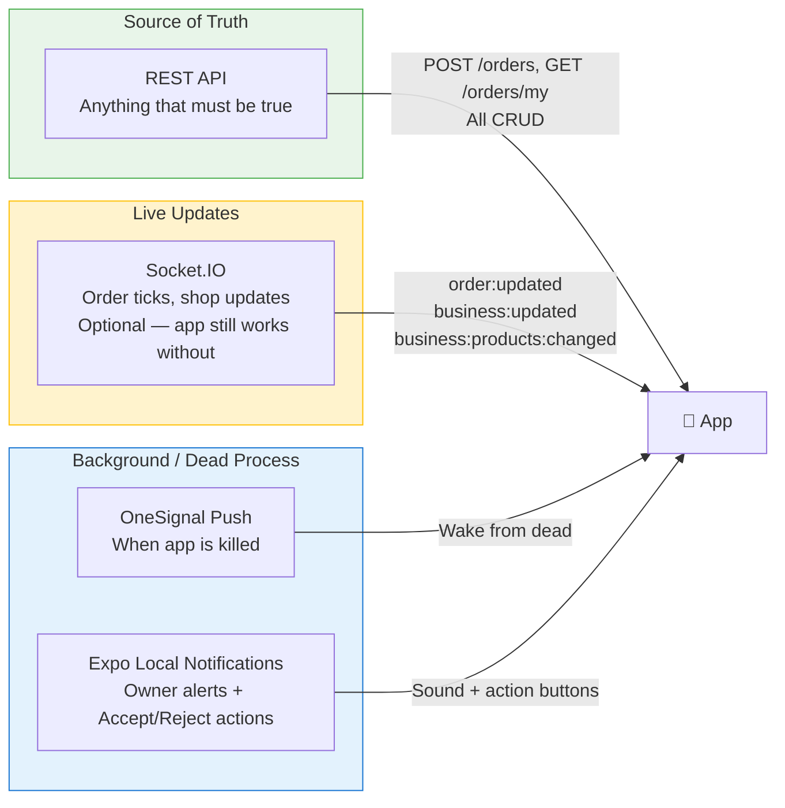
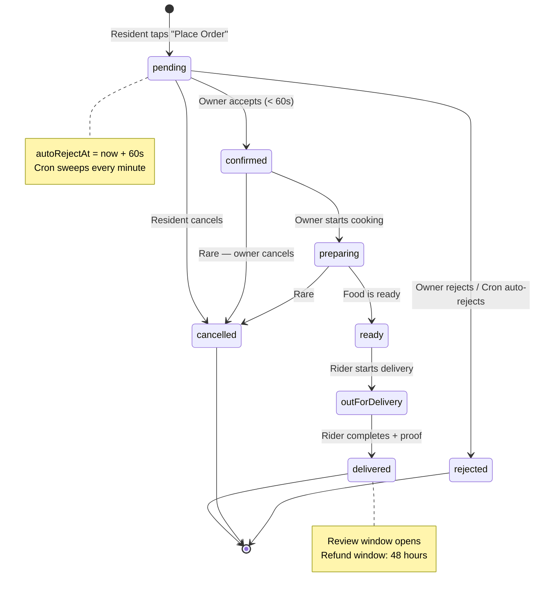

# Mobile App — Three Worlds, One Binary

> **One Expo codebase. Three role-flavored builds. A floating gold cart button.**
> This isn't a novel — it's a treasure map. Jump to any section, poke around, leave smarter.

[Architecture](./ARCHITECTURE.md) · [Web](./WEB.md) · [Backend](./BACKEND.md)

---

## Choose Your Character

```
┌─────────────────────────────────────────────────────────────────┐
│                                                                 │
│   🏠 RESIDENT          🏪 OWNER           🚲 RIDER             │
│   yarn mobile:customer  yarn mobile:business  yarn mobile:delivery │
│                                                                 │
│   Browse, cart, order   Run the shop        Pick up & deliver   │
│   review, refund, chat  accept/reject/cook  start → complete    │
│                                                                 │
│   EXPO_PUBLIC_APP_TARGET=user   =businessOwner   =deliveryPartner │
│                                                                 │
└─────────────────────────────────────────────────────────────────┘
```

Same binary. `RoleGate` + `getDefaultRoute()` send each user to the right house.  
Wrong role on the wrong build? **Instant redirect.** No sneaking.

---

## Boot Sequence — What Happens Before You See Anything

Every cold launch walks through this ritual before a single pixel of your role screen renders:



<details>
<summary><b>What lives in <code>app/_layout.tsx</code> (the root)</b></summary>

| Step | What | Why |
|:---:|---|---|
| 1 | Sentry init | Crash reporting from first render |
| 2 | `SplashScreen.preventAutoHideAsync()` | Hold the splash until we're ready |
| 3 | Notification handler config | Show alerts even in foreground |
| 4 | Android notification channel | "Orders" channel with custom sound file |
| 5 | Font loading | DM Sans (body), DM Serif Text, Fraunces (display), Inter (UI) |
| 6 | OneSignal init | Push service registration |
| 7 | Redux `<Provider>` | Global state tree |
| 8 | `<AuthBootstrap>` | The big one — token hydration, API handshake, socket, flags, ads |

**Key rule:** Splash screen stays visible until `isHydrated === true`. No flash of login screen for returning users.

</details>

---

## Navigation — The Full Map



<details>
<summary><b>How <code>RoleGate</code> works under the hood</b></summary>

`RoleGate` wraps each role group's `_layout.tsx`. It takes an `allowedRole` prop and runs three checks:

```
1. Not authenticated?  → redirect to /(auth)/welcome
2. Authenticated but wrong role?  → redirect to getHomeRouteByRole(user.role)
3. Correct role?  → render children normally
```

**`getDefaultRoute(isAuth, role, appTarget)`** resolves to:
| `role` | Route |
|---|---|
| `user` | `/(user)/home` |
| `businessOwner` | `/(business-owner)/dashboard` |
| `deliveryPartner` | `/(delivery-partner)/dashboard` |
| not authenticated | `/(auth)/onboarding` |

`EXPO_PUBLIC_APP_TARGET` can force a specific role's route regardless.

</details>

---

## Complete Route Tree

```
app/
├── _layout.tsx ·················· Root (Redux, Bootstrap, fonts, push, Sentry)
├── index.tsx ···················· Entry → getDefaultRoute()
│
├── (auth)/
│   ├── _layout.tsx ·············· Redirects if already logged in
│   ├── onboarding.tsx ··········· Hero splash "Fuelling Health with Freshness"
│   ├── welcome.tsx ·············· 🏠 / 🏪 / 🚲 role picker
│   ├── user-login.tsx
│   ├── user-register.tsx
│   ├── business-owner-login.tsx
│   ├── business-owner-register.tsx
│   └── delivery-partner-login.tsx
│
├── (user)/ ······················ RoleGate("user") + useUserRealtimeSync
│   ├── _layout.tsx
│   ├── (tabs)/
│   │   ├── _layout.tsx ·········· Custom tab bar with Cart FAB
│   │   ├── home.tsx ············· Society feed, banners, search
│   │   ├── businesses.tsx ······· Shop directory
│   │   ├── orders.tsx ··········· My order list
│   │   ├── profile.tsx ·········· Me
│   │   ├── addresses.tsx ········ (hidden) Delivery pins
│   │   ├── add-address.tsx ······ (hidden) New pin
│   │   └── verify-phone.tsx ····· (hidden) OTP
│   ├── business.tsx ············· Shop detail / menu
│   ├── product.tsx ·············· Single SKU
│   ├── cart.tsx ················· One-shop cart
│   ├── checkout.tsx ············· Address + pay + coupon
│   ├── order-detail.tsx ········· Track + chat + review
│   └── chat/[sessionId].tsx ···· DM with shop
│
├── (business-owner)/ ··········· RoleGate("businessOwner")
│   ├── _layout.tsx ·············· Tabs + useBusinessOwnerRealtimeSync
│   ├── dashboard.tsx ············ Stats, revenue chart, quick actions
│   ├── products.tsx ············· Product CRUD + form modal
│   ├── orders.tsx ··············· Inbound orders
│   ├── promotions.tsx ··········· Coupons
│   ├── profile.tsx ·············· Owner profile
│   ├── application-received.tsx · (hidden) Pre-verification limbo
│   ├── order-detail.tsx ········· (hidden) Accept/reject/assign
│   └── delivery-partners.tsx ···· (hidden) Rider management
│
└── (delivery-partner)/ ········· RoleGate("deliveryPartner")
    ├── _layout.tsx ·············· Minimal tabs
    ├── dashboard.tsx ············ Delivery queue + stats
    ├── profile.tsx ·············· Rider profile
    └── order-detail.tsx ········· (hidden) Start/complete + proof
```

---

## The Three Tab Bars

### Resident Tab Bar
```
┌───────────────────────────────────────────────────────────┐
│                                                           │
│   🏠 Home    🏪 Stores    ✨🛒✨    📦 Orders    👤 Me   │
│                            ↑                              │
│                     Gold floating FAB                     │
│                     Badge = cart count                    │
│                                                           │
│   Hidden tabs: addresses · add-address · verify-phone     │
└───────────────────────────────────────────────────────────┘
```

### Owner Tab Bar
```
┌───────────────────────────────────────────────────────────┐
│                                                           │
│   📊 Dashboard  📦 Products  📋 Orders  🏷️ Promos  ⚙️ Profile │
│                                  ↑                        │
│                           Badge = active orders           │
│                                                           │
│   Hidden: application-received · order-detail · riders    │
└───────────────────────────────────────────────────────────┘
```

### Rider Tab Bar
```
┌───────────────────────────────────────────────────────────┐
│                                                           │
│           🚲 Deliveries              👤 Profile           │
│                                                           │
│   Hidden: order-detail                                    │
└───────────────────────────────────────────────────────────┘
```

---

## How a Screen Is Built — The Lasagne

Every screen follows a strict four-layer architecture. Think **lasagne**, not spaghetti:

```
┌─────────────────────────────────────────────────────┐
│  ROUTE LAYER          app/(role)/screen.tsx          │  ← Thin. Just JSX.
│  ─ ─ ─ ─ ─ ─ ─ ─ ─ ─ ─ ─ ─ ─ ─ ─ ─ ─ ─ ─ ─ ─ ─  │
│  BRAIN LAYER          src/hooks/useXxx.ts            │  ← Fetch, filter, nav
│  ─ ─ ─ ─ ─ ─ ─ ─ ─ ─ ─ ─ ─ ─ ─ ─ ─ ─ ─ ─ ─ ─ ─  │
│  FACE LAYER           src/components/...             │  ← Visual components
│  ─ ─ ─ ─ ─ ─ ─ ─ ─ ─ ─ ─ ─ ─ ─ ─ ─ ─ ─ ─ ─ ─ ─  │
│  MEMORY LAYER         src/store/slices               │  ← Redux state
│  ─ ─ ─ ─ ─ ─ ─ ─ ─ ─ ─ ─ ─ ─ ─ ─ ─ ─ ─ ─ ─ ─ ─  │
│  PHONE LAYER          src/services/*Service.ts       │  ← API + sockets
└─────────────────────────────────────────────────────┘
```

**Golden rule:** If a file in `app/` is doing math, it stole the hook's job.

<details>
<summary><b>Example: Home Screen data flow</b></summary>



- Seeds from `GET /auth/home-feed` (businesses, featured products, banners, society info)
- Search + category filter is **client-side** on the loaded list
- Collapsing header = `Animated.Value` on scroll (not a new screen)
- Cart badge = Redux `cart.items` summed in the custom tab bar

</details>

---

## Resident World

### Screen Map



### Screen-by-Screen

| Screen | Route | Hook | Key Components | Superpower |
|---|---|---|---|---|
| Home | `(user)/(tabs)/home` | `useHomeScreen` | HomeHero, CategoryTiles, PromoBanner, HorizontalStoreRow, StoreList, DishList, NativeAdCard | Society feed with collapsing animated header, client-side search + category filter |
| Stores | `(user)/(tabs)/businesses` | `useBusinessesScreen` | BusinessListCard, EmptyState | Full shop directory for the society |
| Shop | `(user)/business` | `useBusinessDetail` | MmScreen, ProductCard | Menu grouped by section, add-to-cart inline |
| Product | `(user)/product` | `useProductDetail` | MmScreen | Single SKU zoom, quantity picker |
| Cart | `(user)/cart` | `useCart` | MmButton, EmptyState | **One shop at a time** — locked to `businessId` |
| Checkout | `(user)/checkout` | `useCheckout` | AddressCard, MmInput, MmButton | Address picker, payment method/timing, coupon apply, place order |
| Orders | `(user)/(tabs)/orders` | `useUserOrders` | UserOrderCard, EmptyState | Live status badges, pull-to-refresh |
| Order Detail | `(user)/order-detail` | `useOrderDetail` | AcceptanceCountdown, MmButton | Status timeline, share, chat, review/refund triggers |
| Chat | `(user)/chat/[sessionId]` | `useChat` | ChatScreen | Real-time DMs with shop owner |
| Profile | `(user)/(tabs)/profile` | `useUserProfile` | MmInput, MmButton | Edit name, phone, profile image |
| Addresses | `(user)/(tabs)/addresses` | `useAddresses` | AddressCard | Manage delivery pins |
| Add Address | `(user)/(tabs)/add-address` | `useAddressForm` | FormInput | Street, landmark, city, pincode, type |
| Verify Phone | `(user)/(tabs)/verify-phone` | `usePhoneVerification` | MmInput | OTP send + verify |

<details>
<summary><b>Cart — the one-shop-at-a-time rule</b></summary>

The cart is bound to a single `businessId`. If a resident browses Shop A, adds items, then tries to add from Shop B:

```
Current cart: Shop A (3 items)
Tap "Add" on Shop B product
  → Alert: "Replace cart?"
  → Yes: clear cart, set businessId to Shop B
  → No: stay on Shop B page, cart unchanged
```

**Cart lives in Redux only.** It's persisted to AsyncStorage via Redux persistence, but it's **never sent to the server** until checkout. Kill the app mid-browse and the cart survives. Kill it mid-checkout and... hope AsyncStorage kept it.

- Minimum order: **₹50** (enforced in `useCart`)
- Platform fee: **₹2** (added at checkout)
- No payment gateway — method is a label (cash / UPI / card / wallet)

</details>

---

## Owner World

### The Owner Lifecycle



### The 60-Second Boss Fight



### Owner Screen Details

| Screen | Route | Hook | Key Components |
|---|---|---|---|
| Dashboard | `dashboard` | `useBusinessOwnerDashboard` | Stats cards, revenue chart, recent orders, quick action buttons |
| Products | `products` | `useBusinessOwnerProducts` | ProductCard, ProductFormModal, search + filter, image upload |
| Orders | `orders` | `useBusinessOwnerOrders` | PendingOrderBanner, AcceptanceCountdown, status filter tabs |
| Promotions | `promotions` | `useBusinessOwnerPromotions` | Coupon create/delete, usage tracking |
| Profile | `profile` | `useBusinessOwnerProfile` | Shop settings, image, taking-orders toggle |
| Application Received | `application-received` | — | Static "under review" screen post-registration |
| Order Detail | `order-detail` | `useBusinessOwnerOrderDetail` | Accept/reject buttons, assign rider, status progression |
| Delivery Partners | `delivery-partners` | — | Add/manage riders linked to this shop |

<details>
<summary><b>Owner real-time hooks — the nervous system</b></summary>

| Hook | What It Does |
|---|---|
| `useBusinessOwnerRealtimeSync` | Seeds state via HTTP on mount, then subscribes to Socket.IO rooms (`business:{id}`, `business-orders:{id}`). Upserts orders + products into Redux as events arrive. |
| `useOwnerLocalOrderAlerts` | Plays a local notification sound when a new pending order appears — because push notifications sometimes sleep on Android. Uses Expo Notifications with the custom "Orders" channel. |
| `useOrderNotifications` | Registers **Accept** and **Reject** action buttons on the push notification itself. Owner can respond without opening the app. |
| `useBusinessOwnerSuspension` | Monitors the business profile for `status: 'suspended'`. If detected → full-screen overlay "Your shop has been suspended" → countdown → auto-logout. No escape. Admin must unblock via Web dashboard. |

</details>

---

## Rider World

The rider experience is intentionally minimal. Two tabs, one job.



| What riders see | Statuses in their queue |
|---|---|
| Orders assigned to their shop | `confirmed → preparing → ready → outForDelivery` |
| **Actions they can take** | **Start** (ready → outForDelivery) and **Complete** (proof image + payment) |

---

## Component Toolbox

### UI Primitives (the design system)

| Component | File | Job |
|---|---|---|
| `MmScreen` | `ui/MmScreen` | Standard page wrapper with safe area |
| `GradientScreen` | `GradientScreen` | Page with gradient background |
| `SafeAreaScreen` | `SafeAreaScreen` | Full screen with safe area insets |
| `SafeAreaHeader` | `SafeAreaHeader` | Header bar with gradient + safe area |
| `MmButton` | `ui/MmButton` | Primary/secondary buttons |
| `MmInput` | `ui/MmInput` | Styled text inputs |
| `MmChip` | `ui/MmChip` | Tag/filter chips |
| `MmProgress` | `ui/MmProgress` | Progress indicators |
| `MmBackButton` | `ui/MmBackButton` | Navigation back arrow |
| `BrandLogo` | `ui/BrandLogo` | App logo (SVG) |
| `AppAlertModal` | `ui/AppAlertModal` | Alert/confirm dialogs |
| `PressableScale` | `PressableScale` | Animated press feedback |
| `Skeleton` | `Skeleton` | Loading placeholder |
| `EmptyState` | `EmptyState` | "Nothing here yet" |
| `LoadingScreen` | `LoadingScreen` | Full-screen spinner |
| `BackButton` | `BackButton` | Route-aware back navigation |
| `ScreenHeader` | `ScreenHeader` | Standard screen title bar |
| `FormInput` | `FormInput` | Form field wrapper |

### Feature Components — Who Shows Where

```
┌─────────────────────────────────────────────────────────────────┐
│ RESIDENT SCREENS                                                │
│                                                                 │
│ Home:     HomeHero · CategoryTiles · PromoBanner ·              │
│           HorizontalStoreRow · StoreList · DishList ·           │
│           NativeAdCard (flag-gated)                             │
│                                                                 │
│ Stores:   BusinessListCard · EmptyState                         │
│ Shop:     ProductCard (from business-owner/products/)           │
│ Cart:     line items (inline) · EmptyState                      │
│ Checkout: AddressCard · coupon input                            │
│ Orders:   UserOrderCard                                         │
│ Detail:   AcceptanceCountdown · timeline · RatingModal ·        │
│           RefundModal                                           │
│ Chat:     ChatScreen                                            │
│ Profile:  ProfileImagePicker · AddressCard                      │
├─────────────────────────────────────────────────────────────────┤
│ OWNER SCREENS                                                   │
│                                                                 │
│ Dashboard:  stats cards · revenue chart · recent orders         │
│ Products:   ProductCard · ProductFormModal · ShopImagePicker    │
│ Orders:     PendingOrderBanner · AcceptanceCountdown            │
│ Order Detail: status controls · DeliveryPartnerPickerModal      │
│ Profile:    ShopImagePicker                                     │
│ Registration: SocietyPickerModal · ProfileImagePicker           │
├─────────────────────────────────────────────────────────────────┤
│ RIDER SCREENS                                                   │
│                                                                 │
│ Deliveries: order cards (inline)                                │
│ Detail:     proof upload · complete form                        │
│                                                                 │
├─────────────────────────────────────────────────────────────────┤
│ SHARED                                                          │
│                                                                 │
│ Auth:       RoleGate · RoleLoginForm · LoginRoleSwitcher ·      │
│             BrandLogo · FloatingActionButton                    │
│ Tab bar:    AppTabIcon · UserTabIcon                            │
└─────────────────────────────────────────────────────────────────┘
```

---

## The Complete Hook Catalog

### Resident Hooks

| Hook | Drives Screen | Talks To | Stores In |
|---|---|---|---|
| `useHomeScreen` | Home | `userAppService` → `GET /auth/home-feed` | `userAppSlice` |
| `useBusinessesScreen` | Stores | `userAppSlice` (reads) | — |
| `useBusinessDetail` | Shop | `productService` + `businessOwnerService` | local state |
| `useProductDetail` | Product | local (from nav params) | — |
| `useCart` | Cart | — | `cartSlice` |
| `useCheckout` | Checkout | `orders` API + `coupons/validate` | `cartSlice` (clear on success) |
| `useUserOrders` | Orders | `userAppService` → `GET /orders/my` | `userAppSlice` |
| `useOrderDetail` | Order Detail | `orders/:id` | local state |
| `useChat` | Chat | `chatService` | local state |
| `useUserProfile` | Profile | `authService` → `PUT /auth/profile/me` | `authSlice` |
| `useAddresses` | Addresses | `authService` → `/auth/addresses/me` | local state |
| `useAddressForm` | Add Address | `authService` → `POST /auth/addresses/me` | local state |
| `usePhoneVerification` | Verify Phone | `phoneVerificationService` | `authSlice` |
| `useUserRealtimeSync` | _(layout)_ | `socketService` rooms | `userAppSlice` |
| `useRewardedAd` | Cart/Home | `adService` + `POST /ads/claim-reward` | `cartSlice` (coupon) |

### Owner Hooks

| Hook | Drives Screen | Talks To | Stores In |
|---|---|---|---|
| `useBusinessOwnerDashboard` | Dashboard | `businessOwnerService` → stats/analytics | `businessOwnerSlice` |
| `useBusinessOwnerProducts` | Products | `businessOwnerService` → CRUD + `imageUploadService` | `businessOwnerSlice` |
| `useBusinessOwnerOrders` | Orders | `businessOwnerService` → order list | `businessOwnerSlice` |
| `useBusinessOwnerOrderDetail` | Order Detail | `businessOwnerService` → accept/reject/assign | `businessOwnerSlice` |
| `useBusinessOwnerPromotions` | Promos | `businessOwnerService` → coupons CRUD | local state |
| `useBusinessOwnerProfile` | Profile | `businessOwnerService` → settings/image | `businessOwnerSlice` |
| `useBusinessOwner` | _(shared)_ | `businessOwnerService` → `GET /owner/business` | `businessOwnerSlice` |
| `useBusinessOwnerRealtimeSync` | _(layout)_ | `socketService` + `businessSyncService` | `businessOwnerSlice` |
| `useBusinessOwnerSuspension` | _(layout)_ | monitors `businessOwnerSlice` | triggers logout |
| `useOwnerLocalOrderAlerts` | _(layout)_ | `orderNotificationService` | local push |
| `useOrderNotifications` | _(layout)_ | `orderNotificationService` | notification actions |

### Rider Hooks

| Hook | Drives Screen | Talks To | Stores In |
|---|---|---|---|
| `useDeliveryPartnerOrders` | Deliveries | `deliveryPartnerService` → queue + start/complete | local state |

### Cross-Cutting Hooks

| Hook | Purpose |
|---|---|
| `useAuth` | Login, register, logout orchestration |
| `useUserRegistration` | Multi-step registration with society picker |
| `useRedux` | Typed `useAppDispatch` + `useAppSelector` |
| `useFeatureFlags` | Feature flag values with local overrides |
| `useSuperAdmin` | Legacy — don't use for new features |

---

## Service Layer — Who Calls What



---

## Redux Memory Map

```
┌─ store ────────────────────────────────────────────────────┐
│                                                            │
│  auth ─────────────── Who you are                          │
│  │  user              User object                          │
│  │  tokens            { access, refresh }                  │
│  │  isAuthenticated   Boolean                              │
│  │  isHydrated        Bootstrap complete?                  │
│  │  isLoading / error                                      │
│                                                            │
│  cart ─────────────── Shopping bag (ONE shop)               │
│  │  items             CartItem[]                           │
│  │  businessId        Locked to one shop                   │
│  │                    ⚠️ NOT server-synced                  │
│  │                    Lives in AsyncStorage via Redux       │
│                                                            │
│  userApp ──────────── Resident's world                     │
│  │  societies         Available societies                  │
│  │  selectedSocietyId Current society                      │
│  │  businesses        Shops in society                     │
│  │  banners           Home promo slides                    │
│  │  featuredProducts  Highlighted items                    │
│  │  orders            My order list                        │
│  │  ordersMap         Quick lookup by ID                   │
│  │  favoriteBusinessIds                                    │
│  │  stats             Activity counts                      │
│                                                            │
│  businessOwner ────── Owner's cockpit                      │
│  │  businessProfile   My shop                              │
│  │  products          My catalog                           │
│  │  orders            Inbound orders                       │
│  │  ordersMap         Quick lookup by ID                   │
│  │  stats / analytics Revenue + popular items              │
│  │  selectedOrderId / selectedProductId                    │
│                                                            │
│  society ──────────── Society selection                     │
│  │  selectedSociety   Current society object               │
│  │  societies         All societies list                   │
│                                                            │
│  featureFlags ─────── Feature toggles                      │
│  │  values            From GET /feature-flags              │
│  │  localOverrides    Dev overrides                        │
│  │  initialized       Flag fetch complete?                 │
│                                                            │
│  superAdmin ───────── ⚠️ LEGACY — web owns admin now       │
│                                                            │
└────────────────────────────────────────────────────────────┘
```

---

## Live Wires — How Data Flows in Real Time



| Channel | When | If it's down |
|---|---|---|
| **REST** | Every read/write that matters | App is broken |
| **Socket.IO** | Order status ticks, shop profile updates, product changes | App works — just no live updates until next pull-to-refresh or focus |
| **OneSignal** | Push when the process is killed | User misses notification, but data is still correct on next open |
| **Expo Local Notifications** | Owner "NEW ORDER" sound + Accept/Reject action buttons | Owner must open app to see orders |

**Foreground reconnect is mandatory.** iOS and Android kill idle WebSockets. `socketService.reconnect()` fires on `AppState === 'active'`.

---

## Money — How Payments Work (Today)

```
┌────────────────────────────────────────────────┐
│                                                │
│   Subtotal (sum of line items)                 │
│   + Platform fee          ₹2                   │
│   - Coupon discount       variable             │
│   ═══════════════════════════                  │
│   Final amount                                 │
│                                                │
│   Minimum order:  ₹50                          │
│   Payment methods: cash · UPI · card · wallet  │
│   Payment timing:  atOrder or atDelivery       │
│                                                │
│   ⚠️  NO PAYMENT GATEWAY                       │
│   Method is a label. No Razorpay/Stripe.       │
│   Status is bookkeeping for COD.               │
│                                                │
│   Coupons:                                     │
│   • Shop-created (percentage/flat/fixed)       │
│   • Rewarded-ad coupon (watch ad → get ₹2-5)  │
│   • All behind /feature-flags                  │
│                                                │
└────────────────────────────────────────────────┘
```

---

## The Order Lifecycle — Complete State Machine



---

## Gotchas — Read These Before You Touch Anything

```
╔══════════════════════════════════════════════════════════════════╗
║                    ⚠️  DANGER ZONE  ⚠️                          ║
╠══════════════════════════════════════════════════════════════════╣
║                                                                  ║
║  These aren't theoretical. They WILL bite.                       ║
║                                                                  ║
╚══════════════════════════════════════════════════════════════════╝
```

| Gotcha | Why It Bites | What To Do |
|---|---|---|
| **60-Second Accept Window** | UX countdown, backend `autoRejectAt`, and cron must all agree. Owner taps accept at 61s → `409 ACCEPTANCE_WINDOW_EXPIRED`. Cron runs every _minute_, so worst case is 60-120s before auto-reject fires. | Don't change the window in one place. Search for `60`, `acceptanceWindow`, `autoRejectAt`. |
| **One-Shop Cart** | Cart is locked to a `businessId`. Mixing kirana + pharmacy = product decision, not a bug. | If you're asked to support multi-shop cart, it's a major architecture change. |
| **Pending Products** | Owners add a product → `approvalStatus: pending`. Residents see **nothing** until web admin approves. Owners think they published. | This is the #1 "empty shop" support ticket. Always check approval status first. |
| **Blacklist Overlay** | 5 rejects of the **same resident** within 1 hour → shop AND owner `suspended`. Full-screen overlay, countdown, auto-logout. Admin unblocks on web. | Per-customer, not total rejects. 5 different customers = no suspension. |
| **Mock Auth** | `ENABLE_MOCK_AUTH` (on by default in some envs) = fake tokens. Sockets and push get skipped. "Realtime is broken on simulator" is often this. | Must be `false` in production. Always. |
| **Icon Cache** | Changed the app icon? iOS lies. The old icon stays until you **delete and reinstall**. | Just delete the app. Clearing cache won't help. |
| **`superAdmin` Slice on Mobile** | The Redux slice still exists. Real admin is **web**. Don't build a fourth role flavor unless you explicitly mean to. | Ignore it. Treat it as legacy. |
| **Phone OTP Assumption** | Checkout and high-trust actions assume `isPhoneVerified === true`. Skip verify-phone → mysterious failures. | Make the verify-phone screen mandatory before first checkout. |
| **Sentry DSN** | Empty `EXPO_PUBLIC_SENTRY_DSN` = silent crashes. No errors in Sentry ≠ no errors in production. | Set it before deploying. Always. |
| **Category Enum Mismatch** | `BusinessCategory` in shared `types.ts` has 21 values. `BUSINESS_CATEGORIES` in shared `constants.ts` has 12 different values. Mobile constants have yet another 8. Slugs don't match (`grocery` vs `groceries`, `fast_food` missing). | Pick **one** source of truth and migrate. This affects filters and display. |
| **Cart Not Server-Synced** | Cart lives in Redux + AsyncStorage only. There's no server-side cart. | Kill the app mid-checkout → cart is whatever AsyncStorage held. No recovery from server. |
| **Socket Foreground Reconnect** | iOS/Android kill idle WebSockets aggressively. | `socketService.reconnect()` on `AppState === 'active'` is mandatory. Don't remove it. |

<details>
<summary><b>Quick Self-Test (tap to check your understanding)</b></summary>

**Q1:** Resident adds items from two shops. What happens?  
**A:** Cart is bound to `businessId`. Second shop should trigger replace-or-block — never merge silently.

**Q2:** Owner is in a meeting. Order sits 70 seconds. Who rejects?  
**A:** `node-cron` sweeps every minute. Reason: "Store didn't respond within the 60-second window."

**Q3:** Socket is down. Does checkout work?  
**A:** Yes. REST places the order. Live UI just lags until next refetch or focus.

**Q4:** Owner added 10 products. Residents see 0. Why?  
**A:** Products are `approvalStatus: pending`. Web admin hasn't approved them yet.

**Q5:** Shop is verified but owner sees "Account Blocked." Why?  
**A:** Auto-suspension from rejection streak. Check blacklist — 5 rejects of same user in 1 hour.

</details>

---

> **Next up:** [Backend](./BACKEND.md) for the API rules · [Web](./WEB.md) for the admin panel · [Architecture](./ARCHITECTURE.md) for the full map
