# Mission Control — Super Admin Web Dashboard

> **You are the referee.** Residents never see this. Owners never see this.
> This is the cockpit that keeps the marketplace honest.

[Architecture](./ARCHITECTURE.md) · [Mobile](./MOBILE.md) · [Backend](./BACKEND.md)

---

## At a Glance

```
┌─────────────────────────────────────────────────────────────────────────┐
│  Framework    │  Next.js 14 (App Router)                               │
│  Styling      │  Tailwind CSS                                          │
│  Auth         │  Client-side JWT in localStorage                       │
│  State        │  Local useState + useEffect per page (no Redux)        │
│  API Layer    │  Single fetch wrapper — src/lib/api.ts                 │
│  Audience     │  Super Admin only — one role, god-mode access          │
│  Sockets?     │  Nope. Pull-to-refresh world.                         │
└─────────────────────────────────────────────────────────────────────────┘
```

---

## How You Get In

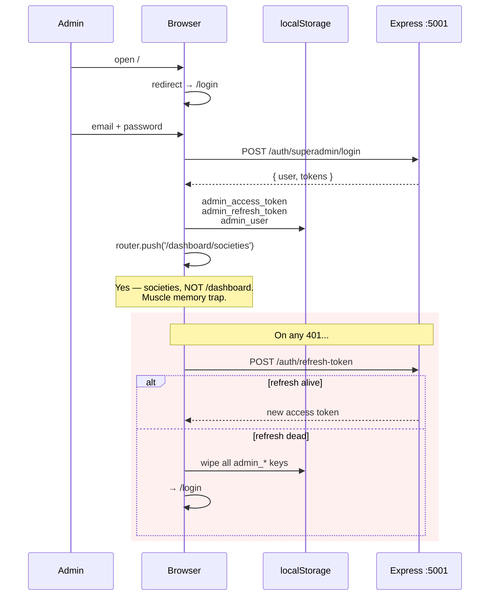

> **No middleware.ts gate.** A clever person can open `/dashboard` HTML.
> But every real API call dies without a valid JWT. Still — don't put secrets in page source.

<details>
<summary>Token storage keys</summary>

| Key | What |
|---|---|
| `admin_access_token` | JWT (~1h TTL) |
| `admin_refresh_token` | Opaque string (~30d) |
| `admin_user` | JSON blob of user profile |

`isAuthenticated()` = `!!getAccessToken()`. That's it. No server session.

</details>

---

## The Dashboard Shell

```
┌──────────────────────────────────────────────────────────────────────────┐
│  🛵 mohallaMitr   [Super Admin]                                         │
│                                                                          │
│  Dashboard   Businesses   Users   Orders   Blacklist   [More ▾]   👤    │
│                                                         ├─ Societies     │
│                                                         ├─ Banners       │
│                                                         ├─ Analytics     │
│                                                         └─ Settings      │
├──────────────────────────────────────────────────────────────────────────┤
│                                                                          │
│                         «  page content  »                               │
│                                                                          │
├──────────────────────────────────────────────────────────────────────────┤
│  mohallaMitr Super Admin · Production API Connected                      │
└──────────────────────────────────────────────────────────────────────────┘

  📱 On mobile: all 9 nav items collapse into a horizontal scroll strip
```

Auth guard lives in `dashboard/layout.tsx` — a `useEffect` checks `isAuthenticated()` on mount, kicks you to `/login` if false.

---

## Route Map — Every Page at a Glance

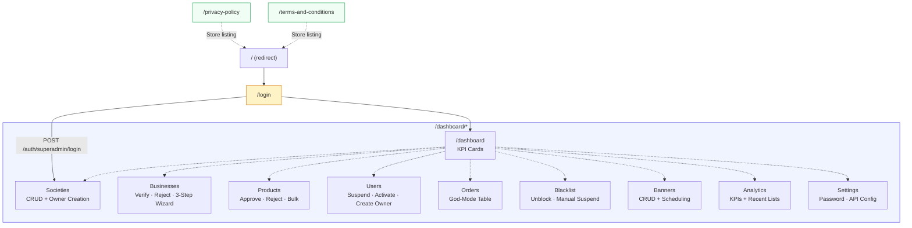

---

## Page-by-Page Breakdown

### `/login` — The Gate

```
┌──────────────────────┬────────────────────────────┐
│                      │                            │
│   ┌──────────────┐   │   Email: [____________]    │
│   │  mohallaMitr  │   │   Password: [________]    │
│   │              │   │                            │
│   │  Your society│   │   [ Sign In →          ]   │
│   │  marketplace │   │                            │
│   │              │   │   error toast if failed     │
│   └──────────────┘   │                            │
│                      │                            │
│  gradient: purple →  │                            │
│            indigo    │                            │
└──────────────────────┴────────────────────────────┘
```

Split-screen. Left = branding gradient. Right = form.
On success: `router.push('/dashboard/societies')`.

---

### `/dashboard` — Command Center

Five KPI tiles, each one a live number from `GET /admin/stats`:

```
┌──────────┐  ┌──────────┐  ┌──────────┐  ┌──────────┐  ┌──────────┐
│  Active   │  │  Total    │  │ Pending   │  │Registered│  │  Total   │
│ Societies │  │Businesses │  │Verif.     │  │  Users   │  │ Orders   │
│    12     │  │    48     │  │     3     │  │   2.1k   │  │   890    │
└──────────┘  └──────────┘  └──────────┘  └──────────┘  └──────────┘

Quick Actions:
  → Manage Societies    → Review Businesses
  → Approve Products    → View Orders
```

---

### `/dashboard/societies` — Build the Map

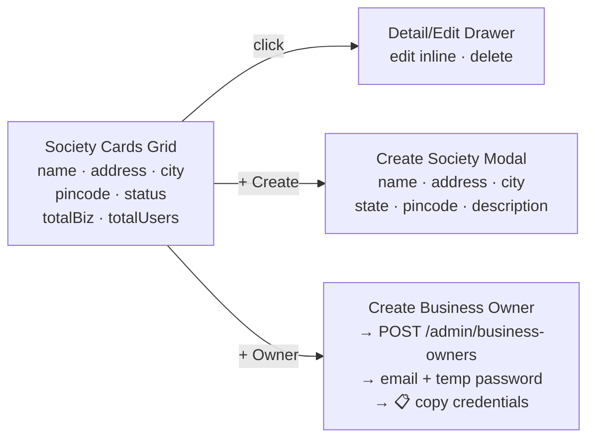

| API Call | When |
|---|---|
| `GET /admin/societies` | Page load |
| `POST /societies` | Create modal submit |
| `PUT /societies/:id` | Drawer edit save |
| `DELETE /societies/:id` | Drawer delete |
| `POST /admin/business-owners` | Owner creation modal |

---

### `/dashboard/businesses` — The Verification Desk

The busiest page. This is where shops go from "applied" to "live."

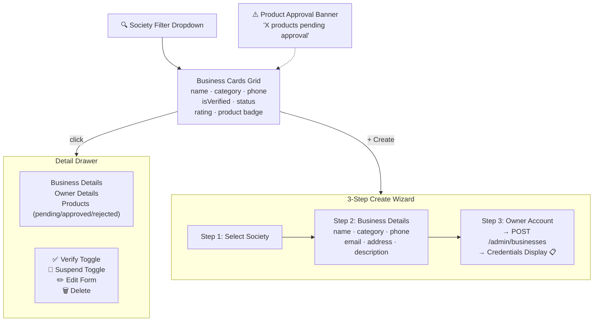

<details>
<summary>API endpoints used on this page</summary>

| Endpoint | Method | Purpose |
|---|---|---|
| `/businesses` | GET | Load business list |
| `/societies?limit=100` | GET | Society filter dropdown |
| `/admin/products?approvalStatus=pending\|rejected` | GET | Pending count for banner |
| `/users/:ownerId` | GET | Owner details in drawer |
| `/businesses/:id` | PUT | Edit business |
| `/businesses/:id` | DELETE | Delete business |
| `/admin/businesses` | POST | 3-step create wizard |

</details>

---

### `/dashboard/products` — The Catalog Gatekeeper

Full-height master/detail layout. This is where you decide what residents can buy.

```
┌─────────────────────────────┬──────────────────────────────────┐
│  [Pending] [Approved] [Rej] │                                  │
│  ☐ Society filter ▾         │  Product Name                    │
│  ☐ Business filter ▾        │  ₹120    Stock: 45   ● Active   │
│                              │                                  │
│  ☑ Organic Milk         ₹68 │  Business: DailyFresh Mart       │
│  ☑ Paneer 200g         ₹120 │  Category: Dairy                 │
│  ☐ Brown Rice 1kg       ₹85 │  Section: Essentials             │
│  ☐ Amul Butter         ₹280 │                                  │
│                              │  [✅ Approve] [❌ Reject + Note] │
│  [Bulk Approve] [Bulk Rej]  │                                  │
└─────────────────────────────┴──────────────────────────────────┘
       ← master (tabbed list)        detail pane →
```

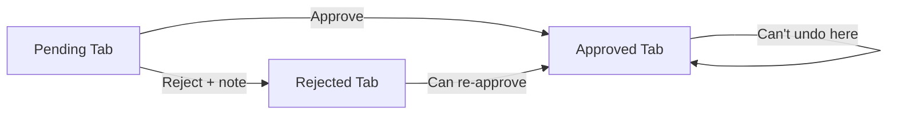

Cascading filters: pick a society → only its businesses show → only their products show.

---

### `/dashboard/users` — The People Registry

| Column | Content |
|---|---|
| Avatar | Initials circle |
| Name | First + Last |
| Email | email |
| Phone | phone |
| Role | Badge: `user` · `businessOwner` · `deliveryPartner` · `superAdmin` |
| Status | Badge: `active` · `suspended` · `inactive` |
| Actions | Suspend / Activate |

Filters: Role dropdown + Status dropdown.
"Create Owner" button opens the same owner creation modal → credentials clipboard.

---

### `/dashboard/orders` — God Mode

```
┌────────────────────────────────────────────────────────────────┐
│  Status: [All ▾] [pending] [confirmed] [preparing] [ready]    │
│          [out_for_delivery] [delivered] [cancelled] [rejected] │
├────────┬───────────┬──────────────┬─────────┬────────┬────────┤
│ ID     │ Customer  │ Business     │ Status  │ Amount │ Date   │
├────────┼───────────┼──────────────┼─────────┼────────┼────────┤
│ ...a3f │ Raj K.    │ DailyFresh   │ ● deliv │ ₹342   │ Sep 26 │
│ ...b17 │ Priya S.  │ Spice Route  │ ● prep  │ ₹180   │ Sep 26 │
│ ...c92 │ Amit T.   │ MediTrust    │ ● pend  │ ₹520   │ Sep 25 │
└────────┴───────────┴──────────────┴─────────┴────────┴────────┘
  [← Previous]                                    [Next →]  25/page
```

Read-only. You can see everything but can't change statuses here. That power lives on mobile.

---

### `/dashboard/blacklist` — The Unban Bureau

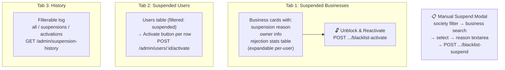

---

### `/dashboard/banners` — Homepage Real Estate

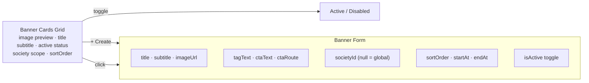

> **Banner not showing?** Check society scope AND date range before blaming mobile.

---

### `/dashboard/analytics` — The Numbers (lite)

Same 5 KPI cards as the main dashboard + 3 "recent" lists (last 5 societies, businesses, users with dates).

> **No charts.** `recharts` is in `package.json` but the page doesn't use it. Cleanup opportunity.

---

### `/dashboard/settings` — Nerd Knobs

- Account info display (email, user ID from localStorage)
- Change password form → `POST /auth/change-password`
- API config display (shows `NEXT_PUBLIC_API_BASE_URL`)

---

### Legal Pages (SSR)

`/privacy-policy` and `/terms-and-conditions` — static server-rendered pages.
Effective date: 20 July 2026. Cross-linked.
**Must stay live** — App Store and Play Store listings point to these URLs.

---

## The Admin's Daily Workflow

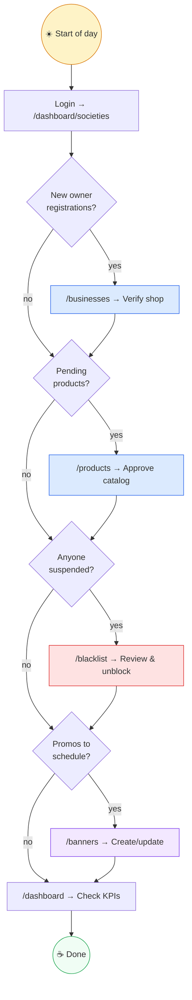

> **The golden rule:** If residents say "the shop is empty," you probably forgot
> product approval — not a mobile bug.

---

## The Single API File

Everything goes through `apps/web/src/lib/api.ts`:

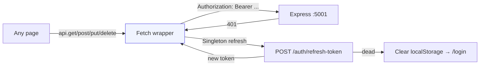

**Base URL:** `NEXT_PUBLIC_API_BASE_URL` or fallback `http://127.0.0.1:5001`

<details>
<summary>Complete API endpoints used across all pages</summary>

| Endpoint | Method | Page(s) |
|---|---|---|
| `/auth/superadmin/login` | POST | Login |
| `/auth/refresh-token` | POST | api.ts (auto) |
| `/auth/change-password` | POST | Settings |
| `/admin/stats` | GET | Dashboard, Analytics |
| `/admin/societies` | GET | Societies, Products, Blacklist |
| `/admin/business-owners` | POST | Societies, Businesses, Users |
| `/admin/businesses` | POST | Businesses (create wizard) |
| `/admin/products?approvalStatus=...` | GET | Businesses, Products |
| `/admin/products/:id/approve` | POST | Products |
| `/admin/products/:id/reject` | POST | Products |
| `/admin/users/:id/suspend` | POST | Users |
| `/admin/users/:id/activate` | POST | Users, Blacklist |
| `/admin/orders` | GET | Orders |
| `/admin/blacklist` | GET | Blacklist |
| `/admin/businesses/:id/blacklist-activate` | POST | Blacklist |
| `/admin/businesses/:id/blacklist-suspend` | POST | Blacklist |
| `/admin/suspension-history` | GET | Blacklist |
| `/admin/banners` | GET/POST | Banners |
| `/admin/banners/:id` | PUT/DELETE | Banners |
| `/societies` | POST | Societies (create) |
| `/societies/:id` | PUT/DELETE | Societies |
| `/businesses` | GET | Businesses, Blacklist |
| `/businesses/:id` | PUT/DELETE | Businesses |
| `/users` | GET | Users, Blacklist |
| `/users/:id` | GET/DELETE | Businesses (owner detail), Users |

</details>

---

## Codebase Shape

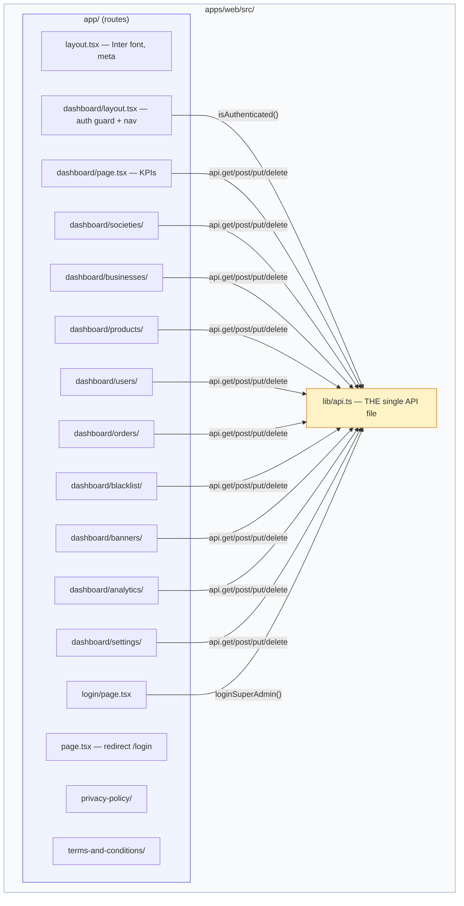

Notable about the structure:
- **No `src/components/` directory** — all UI lives inline in page files
- **No global state** — every page is self-contained with `useState` + `useEffect`
- **No custom hooks** — data fetching is inline `useEffect` with `api.get()`

---

## Phantom Dependencies

These are in `package.json` but **never imported by any page**:

| Package | Supposed Job | Reality |
|---|---|---|
| `axios` | HTTP client | `api.ts` uses native `fetch` |
| `@reduxjs/toolkit` + `react-redux` | State management | Every page uses local `useState` |
| `react-hook-form` + `@hookform/resolvers` + `zod` | Form validation | All forms are manual `useState` |
| `date-fns` | Date formatting | Uses native `toLocaleString()` |
| `recharts` | Charts & graphs | Analytics page has no charts |
| `lucide-react` | Icons | Icons are emoji or inline SVG |

> **5 of 7 non-framework deps are dead weight.** Free cleanup: remove them and shrink the bundle.

---

## Watch-Outs

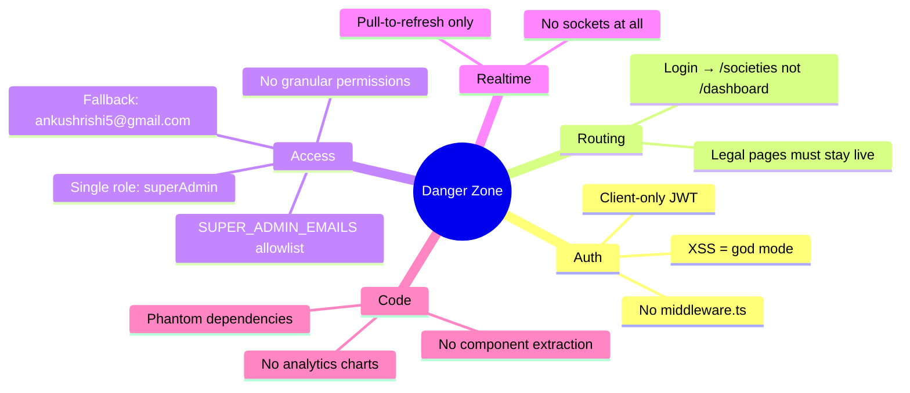

| Severity | Issue | What Happens If Ignored |
|---|---|---|
| **P0** | Client-only auth | XSS on this origin = stolen admin JWT = god mode |
| **P0** | `SUPER_ADMIN_EMAILS` allowlist | Don't rely on "we hid the URL" — lock it server-side |
| **P1** | No middleware.ts gate | Dashboard HTML loads for anyone, API calls just fail |
| **P1** | Legal pages go down | App Store / Play Store rejection |
| **P2** | Login redirects to `/societies` | Not a bug — but will confuse new admins expecting `/dashboard` |
| **P2** | No sockets | Admin dashboard is always stale until refresh |
| **P2** | 5 phantom deps | Bundle bloat, misleading code archeology |
| **P3** | Analytics has no charts | `recharts` is installed for nothing |

---

<details>
<summary>Quick Quiz — Tap to Test Yourself</summary>

**1. Owner added 12 products. Residents see 0. First place you look?**
> `/dashboard/products` → pending approvals tab. Approve them.

**2. Shop is verified but owner sees "Account Blocked" on mobile.**
> `/dashboard/blacklist` → Suspended Businesses tab. Auto-suspend from rejection streak. Hit "Unblock & Reactivate."

**3. You refresh the browser tab. Still logged in. Where did the session go?**
> `localStorage` keys: `admin_access_token`, `admin_refresh_token`, `admin_user`.

**4. Someone asks "is the admin dashboard real-time?"**
> No. No sockets. No polling. Pure pull-to-refresh. Every page fetches on mount.

**5. You want to add a new admin page. What's the minimal setup?**
> Create `app/dashboard/your-page/page.tsx` with `'use client'`, `useState` + `useEffect` calling `api.get(...)`. That's it — layout and auth guard are inherited.

</details>
